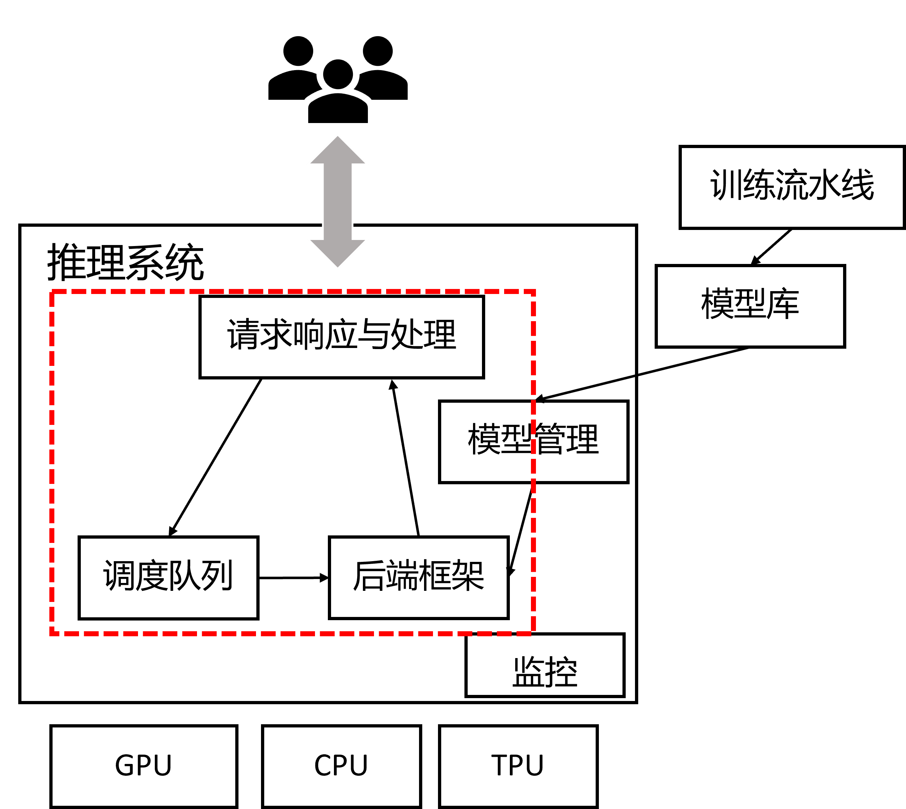
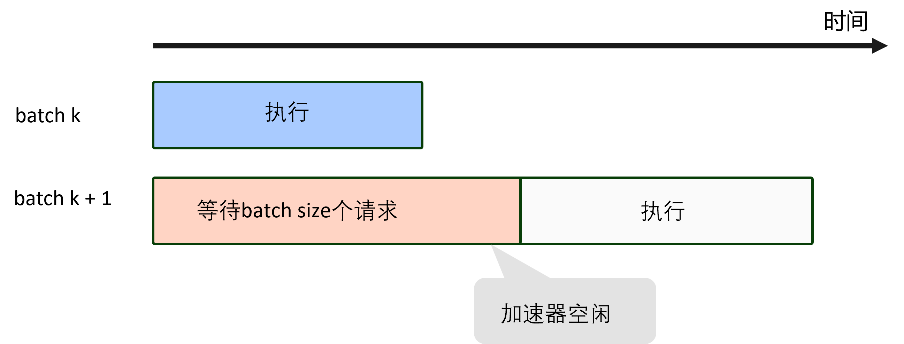
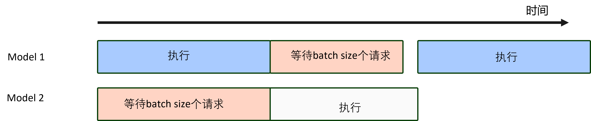
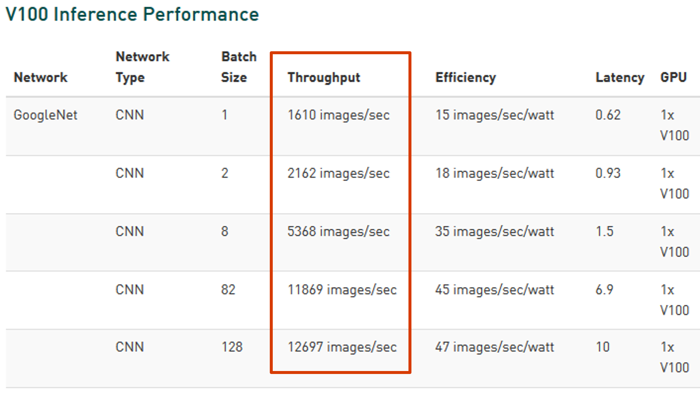
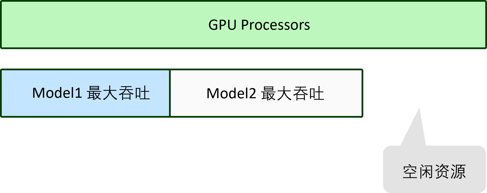
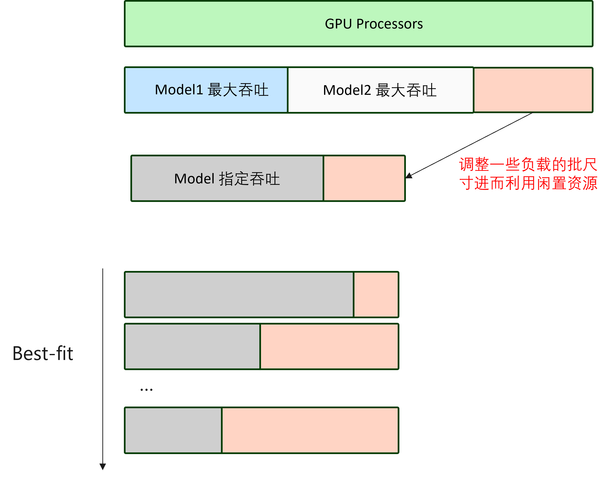

<!--Copyright © Microsoft Corporation. All rights reserved.
  适用于[License](https://github.com/microsoft/AI-System/blob/main/LICENSE)版权许可-->


# 8.4 推理系统的运行期优化

<center> </center>
<center>图 8-4-0. 推理系统运行期优化 </center>

推理系统类似传统的 Web 服务，需要应对不断增加的用户请求数量，提高吞吐量（Throughput），提升资源利用率（Utilization）。如图所示，本小节将围绕推理系统中涉及到的运行期（Runtime）优化，以及吞吐和效率问题进行展开。

- [8.4 推理系统的运行期优化](#84-推理系统的运行期优化)
  - [8.4.1 推理系统的吞吐量](#841-推理系统的吞吐量)
  - [8.4.2 加速器模型并发执行](#842-加速器模型并发执行)
  - [8.4.3 动态批尺寸](#843-动态批尺寸)
  - [8.4.4 多模型装箱（Bin Packing）](#844-多模型装箱bin-packing)
  - [8.4.5 内存分配策略调优](#845-内存分配策略调优)
  - [8.4.6 深度学习模型内存分配算法实验与模拟研究](#846-深度学习模型内存分配算法实验与模拟研究)
    - [(1) 数据获取](#1-数据获取)
    - [(2) 评测指标设定](#2-评测指标设定)
    - [(3) 算法实现与评测](#3-算法实现与评测)
  - [小结与讨论](#小结与讨论)
  - [参考文献](#参考文献)

## 8.4.1 推理系统的吞吐量

推理系统不仅要追求低延迟，在服务客户端请求的过程中，要提供高吞吐量请求服务的支持。推理系统需要高吞吐的目的：
- 应对突发的请求数量暴增
- 不断扩展的用户和设备的需求

推理系统达到高吞吐的常见优化策略有：
- 利用加速器并行
  - 批处理请求（Request）
  - 利用优化的 BLAS 矩阵运算库，SIMD 指令和 GPU 等加速器加速，提升利用率
- 自适应批尺寸（Batch Size）
- 多模型装箱使用加速器
- 扩展到多模型副本（Replica）部署

同时推理运行期的内存管理也会影响延迟和吞吐性能，我们在之后也会展开介绍。

在接下来的内容中，我们将介绍增加模型推理吞吐量的常用策略。

## 8.4.2 加速器模型并发执行

加速器的低效率使用常常由于所执行的负载的运算量不够高或者由于等待请求或 IO 等造成资源空置和浪费。如图 8-4-1 所示，如果设备（Device）中只部署了单个模型，由于等待批处理请求，可能造成 GPU 空闲。

<center> </center>
<center>图 8-4-1. 加速器的低效率使用</center>

为了应对，单加速器运行多模型，推理系统可以通过时分复用策略，并发（Concurrent）执行模型，如图 8-4-2 所示，将等待时的计算资源分配给其他模型进行执行，提升整体的推理吞吐量（Throughput）和设备利用率（Utilization）。

<center> </center>
<center>图 8-4-2. 并发执行提升加速器的效率使用</center>

***经典回顾***

[并发计算（Concurrent Computing）](https://en.wikipedia.org/wiki/Concurrent_computing)：并发计算是多个计算在重叠的时间段内同时执行，而不是完全顺序执行的计算模式。并发计算是模块化编程的一种范例，整体计算任务被分解为可以同时执行的子计算任务。并发计算领域的先驱者包括 Edsger Dijkstra、Per Brinch Hansen 和 C.A.R. Hoare 等。并发计算的概念经常与并行计算（Parallel Computing）概念混淆，因为两者在很多资料被描述为在同一时间段内执行的多个进程。在并行计算中，执行发生在同一物理时刻：例如，在多处理器机器的不同处理器上，同时刻执行多个任务。相比之下，并发计算由重叠的进程生命周期组成，但执行不必在同一时刻发生，例如单核交替执行两个任务，一个任务I/O的时候让出计算核给另一个任务。

## 8.4.3 动态批尺寸

例如，如下图所示，NVIDIA 所做的在 V100 上的推理性能基准测试，从图中可以看到，随着批尺寸（Batch Size）不断增加，模型推理的吞吐量在不断上升，但同时推理延迟（Latency）在下降。

<center> </center>
<center>图 8-4-3. NVIDIA深度学习推理性能测试 <a href="https://developer.nvidia.com/deep-learning-performance-training-inference">图片来源</a> </center>

由于通过提升批尺寸（Batch Size）可以提升吞吐量，对于较高请求数量和频率的场景，通过大的批次可以提升吞吐量。但是推理系统要注意，没有免费的午餐，随着吞吐量上升的还有延迟，推理系统推理在动态调整批尺寸时需要满足一定的延迟约束。

定义优化问题：

$$max_{batch\_size}\{Throughput(batch\_size)\}$$

约束：

$$latency(batch\_size) + overhead(batch\_size) \leq latency\_SLA $$

动态批处理尺寸（Batch Size）的尺寸增长和减少，在相关工作 [Clipper](https://www.usenix.org/system/files/conference/nsdi17/nsdi17-crankshaw.pdf) 中有借鉴 [Additive Increase Multiplicative Decrease (AIMD)](https://en.wikipedia.org/wiki/Additive_increase/multiplicative_decrease) 策略。

***经典回顾***

[加性增加/乘性减少（AIMD）](https://en.wikipedia.org/wiki/Additive_increase/multiplicative_decrease) 算法是一种反馈控制算法，其被应用在TCP拥塞控制中。AIMD 将没有拥塞时拥塞窗口的线性增长与检测到拥塞时的指数减少相结合。使用 AIMD 拥塞控制的多个流最终将收敛到均衡使用共享链路。

AIMD 在动态批尺寸中使用的策略：
- 加性增加（Addictive Increase）: 
  - 将批次大小累加增加固定数量，直到处理批次的延迟超过目标延迟为止。
- 乘性减少（Multiplicative Decrease）: 
  - 当达到后，执行一个小的乘法回退。例如，将批次大小减少 10%。
  - 因为最佳批次大小不会大幅波动，所以使用的退避常数要比其他应用场景使用的AIMD 方案小得多。

接下来我们以 NVIDIA Triton 推理服务器为例看实际系统中支持的动态批尺寸功能。NVIDIA Triton 支持[动态批尺寸器（Dynamic Batcher）](https://github.com/triton-inference-server/server/blob/main/docs/model_configuration.md#dynamic-batcher)，动态批处理允许服务器组合推理请求，从而动态创建批处理。创建一批请求通常会增加吞吐量。动态批处理器应该用于无状态模型。动态创建的批次分布到为模型配置的所有模型实例。一般可以通过下面的流程实施：

以下步骤是为每个模型调整动态批处理器的推荐过程。其还推荐，可以使用[模型分析器](https://github.com/triton-inference-server/server/blob/main/docs/model_analyzer.md)自动搜索不同的动态批处理器配置。

- 确定模型的最大批量大小 max_batch_size 。

- 将以下内容添加到模型配置中以启用动态批处理器。默认策略是：动态批处理器将创建尽可能大的批次并且成批时不会耽误（和下面介绍的此配置相关 max_queue_delay_microseconds），直到最大批次大小（max_batch_size） 。

```yml
    dynamic_batching { }
```

- 使用性能分析器确定默认动态批处理器配置提供的延迟和吞吐量，相比于上面提到的AIMD 策略，当前为人工介入，读者也可以将AIMD的思路应用于配置批尺寸的实验尝试中。根据性能约束，确定合适的批尺寸，之后再进行配置。
如果默认配置导致延迟值在您的延迟预算范围内，请尝试以下一种或两种方法来权衡增加的延迟以增加吞吐量：
  - 增加最大批量大小。max_batch_size 属性表示模型支持的最大批量大小，可用于 Triton 可以利用的批处理类型。
  - 将批处理延迟（Batch Delay）max_queue_delay_microseconds 设置为非零值，动态批处理器可以配置为允许请求在调度器中延迟有限的时间，以允许其他请求加入动态批处理。尝试增加延迟值直到超过延迟预算以查看对吞吐量的影响。

- 大多数模型不应使用首选批尺寸（Preferred Batch Sizes）。仅当该批大小导致性能明显高于其他批大小时，才应配置首选批大小。
preferred_batch_size 属性指示动态批处理器应尝试创建的批处理大小。

下面的[代码实例](https://github.com/triton-inference-server/server/blob/main/docs/model_configuration.md#preferred-batch-sizes)配置Triton应用动态批尺寸，并且配置首选批尺寸（Preferred Batch Sizes）为4或者8。

```yml
  dynamic_batching {
    preferred_batch_size: [ 4, 8 ]
  }
```

## 8.4.4 多模型装箱（Bin Packing）

在延迟服务等级协议（SLA）约束下，模型在指定的GPU下按最大吞吐量进行分配，但是可能仍有空闲资源，造成加速器的低效率使用。

如图所示，有些设备（Device）上的算力较高，部署的模型运算量又较小，使得设备上可以装箱（Bin Packing）多个模型，共享使用设备。

<center> </center>
<center>图 8-4-4. 模型没有用满GPU产生空闲GPU资源</center>

如图所示，推理系统可以通过[最佳匹配(best fit)](https://en.wikipedia.org/wiki/Best-fit_bin_packing)策略装箱（Bin Packing）模型，将碎片化的模型（例如，model1和model2）请求由共享的设备进行推理。这样不仅提升了推理系统的吞吐（Throughput），也提升了设备的利用率（Utilization）。装箱在数据中心资源调度中是经典与传统的问题，我们可以看到系统抽象的很多问题会在不同应用场景与不同层再次出现，但是抽象出的问题与系统算法会由于假设和约束不同产生新的变化，所以系统工作本身既要熟悉经典，也需要了解新场景与变化趋势。

<center> </center>
<center>图 8-3-4. 空闲GPU资源</center>

接下来我们以 NVIDIA Triton 推理服务器为例看实际系统中支持的动态批尺寸功能与策略。NVIDIA Triton 支持[并发模型执行（Concurrent Model Execution）](https://github.com/triton-inference-server/server/blob/main/docs/architecture.md#concurrent-model-execution)机制，充分利用现有加速器。Triton提供了实例组（Instance-Group）的模型配置选项，它允许每个模型指定应该允许该模型的并行执行次数。 每个此类启用的并行执行称为一个实例。默认情况下，Triton 为系统中的每个可用 GPU 为每个模型提供一个实例。 
如下面实例所示模型配置 ModelInstanceGroup 属性用于指定应该可用的执行实例的数量以及应该为这些实例使用的计算资源。实例组（instance_group）设置可用于在每个 GPU 上或仅在某些 GPU 上放置模型的多个执行实例。 这样相当于利用上面提到的装箱策略，提升并发度和加速器利用率，充分利用资源。例如，以下配置将在每个系统 GPU 上放置模型的两个执行实例。以下配置将在 GPU 0 上放置一个执行实例，在 GPU 1 和 2 上放置两个执行实例（[实例来源](https://github.com/triton-inference-server/server/blob/main/docs/model_configuration.md#multiple-model-instances)）。

```yml
  instance_group [
    {
      count: 1
      kind: KIND_GPU
      gpus: [ 0 ]
    },
    {
      count: 2
      kind: KIND_GPU
      gpus: [ 1, 2 ]
    }
  ]
```

***经典回顾***

[装箱（Bin Packing）](https://en.wikipedia.org/wiki/Bin_packing_problem)：装箱问题是一个组合优化问题，其中不同大小的物品必须装入有限数量的箱或容器中，每个箱或容器具有固定的给定容量，其方式为最小化使用的箱数量。该方法有许多应用，例如填充容器、物流车辆装载、大规模平台资源调度等。当前我们可以认为 GPU 是箱子，而模型就是要装入的物品，将运行时的模型调度抽象为装箱问题。

## 8.4.5 内存分配策略调优

由于设备或服务端内存是紧缺资源，推理系统常常也需要考虑做内存的分配策略的优化，进而能够服务更大的模型。

- 目标：最小化内存占用和内存分配调用开销
- 约束：保证延迟服务等级协议（SLA）
- 优化策略：
  - 缓存分配器（Cached Allocator）：推理系统预先申请设备内存，构建推理系统的内存管理器，减少设备内存分配释放等 API 调用代价(例如，[cudaFree调用可能阻塞它的调用者，直到所有GPU上所有先前排队的工作完成](https://arxiv.org/abs/1912.01703))。
  - [预取（Prefetch）和卸载（Off-loading）](https://arxiv.org/abs/1602.08124)：异步地将设备内存数据在读取前和产生后和主存进行换入换出，减少设备内存的数据压力。
  - [算子融合（Fusion）](https://github.com/microsoft/nnfusion)：将中间结果在缓存层给下一阶段的内核使用，减少中间结果回写吞吐和延迟更低的设备内存或者主存的开销。

读者也可以参考相关工作（例如，[DNNMem](https://dl.acm.org/doi/abs/10.1145/3368089.3417050)，[vDNN](https://dl.acm.org/doi/10.5555/3195638.3195660 )等）进一步了解深度学习模型内存的分配占用分类和优化策略。

同时请读者对比和思考，推理内存管理和训练内存管理异同，以及相关工作趋势。
1. 训练作业与框架内存管理：
   1. 张量为单位，有反向传播和权重更新，进而前向传播张量存活时间（Liveness）更久。
   2. 吞吐量为主要目的。
   3. 批尺寸大，对内存尺寸（Memory Size）要求更高。
2. 推理系统内存管理：
   1. 张量为单位，无反向传播和权重更新，张量依赖少，用完即可释放。
   2. 延迟为主要约束。
   3. 服务端推理批尺寸小，但是边缘侧设备内存尺寸小约束强。

所以推理系统的内存管理可以借鉴传统 Web 服务和移动 APP 的内存管理设计思想结合深度学习负载特点进行设计。而训练作业更多工作朝着批处理作业或者延迟不敏感应用发展，一部分工作借助虚拟内存思想，靠“外存”（主存或者 NVMe 等高速存储）和异步化 IO 进行内存管理优化，例如[vDNN](https://dl.acm.org/doi/10.5555/3195638.3195660)，[NVIDIA Unified Memory](https://developer.nvidia.com/blog/unified-memory-cuda-beginners/) 等工作，另一部分是从算法分析层面入手，从算法层面减少冗余（ 本地不留副本与按序加载的 [ZeRO](https://arxiv.org/pdf/1910.02054.pdf) 等，其整体思路类似传统的参数服务器，按需加载权重到本地计算)或者重算（[Gradient Checkpointing](https://github.com/cybertronai/gradient-checkpointing)等）。
例如，传统程序中，[Facebook jemalloc](https://engineering.fb.com/2011/01/03/core-data/scalable-memory-allocation-using-jemalloc/) 为服务端应用设计，其设计思路为：
- 性能与并发管理：支持快速的分配回收，并发请求的内存管理，尽量减少锁争用问题。
- 空间与碎片：减少元数据大小，根据应用选择块尺寸类型。
- 工作负载驱动：隔离小对象，重用时优先使用低地址。
- 全面考虑互操作：例如，操作系统交互方面的优化，减少页换出策略，减少激活页集合等策略。

同时 jemalloc 参考了大量已有的内存管理器的设计。希望以上的设计思路能启发读者针对推理服务特点设计区别于训练作业的内存管理策略。以上思路可以指导我们对数据中心推理服务的内存管理设计。

感兴趣的读者可以在 8.4.6 进行内存管理观测与实验，深入理解深度学习的内存管理技术。

## 8.4.6 深度学习模型内存分配算法实验与模拟研究

此实验需要读者自行参考下面方式收集数据集。

### (1) 数据获取
读者可以参考库中提供的脚本读取数据并了解数据模式。

- 日志收集

我们通过下面的实例或者脚本进行深度学习作业的日志收集，进而获取张量尺寸信息，分配（Allocation）和释放（Deallocation）信息。
```shell
# 假设 TensorFlow 1.13 版本
export TF_CPP_MIN_VLOG_LEVEL=2 
python tf_infer.py # 程序中为常见的 TensorFlow 推理或训练程序
```
- 张量分配与释放相关日志抽取，进而获取张量的大小与分配释放顺序

例如，其中一条张量分配日志如下
```
20XX-XX-XX 12:20:44.472769: I tensorflow/core/framework/log_memory.cc:35] __LOG_MEMORY__ MemoryLogTensorAllocation { step_id: 2 kernel_name: "vgg_16/pool3/MaxPool" tensor { dtype: DT_FLOAT shape { dim { size: 64 } dim { size: 256 } dim { size: 28 } dim { size: 28 } } allocation_description { requested_bytes: 51380224 allocated_bytes: 51380224 allocator_name: "GPU_0_bfc" allocation_id: 101 has_single_reference: true ptr: 140615920648192 } } }
```

分配张量日志实例与关键字
```
MemoryLogTensorAllocation
```

释放张量日志实例与关键字
```
MemoryLogTensorDeallocation
```

[参考文档](https://stackoverflow.com/questions/36331419/tensorflow-how-to-measure-how-much-gpu-memory-each-tensor-takes/43189934#43189934)

### (2) 评测指标设定

读者可以设计以下评测指标，进行算法策略设计：

- 最小化时间开销
  - malloc()、free() 例程在一般情况下应该尽可能快。
- 最小化空间（Space）占用
  - 分配器不应该浪费空间，它应该从系统中获取尽可能少的内存，并且应该以最小化碎片（Fragmentation）的方式维护内存。碎片是程序不使用的连续内存块中的无法再分配的内存空闲浪费区域。
- 最小化局部性（Locality）
  - 分配通常在彼此附近一起使用的内存块。 这有助于在程序执行期间最大限度地减少页面和缓存未命中。
- 其他

### (3) 算法实现与评测

- 内存分配器模拟与算法设计
  - 假设设计的内存分配器依赖调用底层 NVIDIA [cudaFree](https://docs.nvidia.com/cuda/cuda-runtime-api/group__CUDART__MEMORY.html#group__CUDART__MEMORY_1ga042655cbbf3408f01061652a075e094) 和 [cudaMalloc](https://docs.nvidia.com/cuda/cuda-runtime-api/group__CUDART__MEMORY.html#group__CUDART__MEMORY_1g37d37965bfb4803b6d4e59ff26856356) 原语获取设备原始内存，但是此 API 调用有一定的时间代价。参考本文或其他测试数据中进行量化模拟 API 调用时间开销：[当使用 cudaMalloc 和 cudaFree 时，增加矩阵大小时性能退化分析](https://arxiv.org/pdf/1510.05041.pdf)。
- 设计实现 malloc()，free() 接口并实现内部算法
  
读者可以选用以经典算法作为基准测试（例如，[DNNMem](https://dl.acm.org/doi/10.1145/3368089.3417050) 中介绍的主流框架内存分配算法，或者传统[内存分配器策略](https://www.cs.tufts.edu/~nr/cs257/archive/doug-lea/malloc.html)），设计新的算法，并通过收集的数据模拟，看能否提升当前目标，超越基准算法，并进行结果分析，形成分析报告或论文。


***经典回顾***

[伙伴内存分配（Buddy Memory Allocation）](https://en.wikipedia.org/wiki/Buddy_memory_allocation)：伙伴内存分配技术是一种内存分配算法，它将内存划分为多个分区，以尽可能地满足内存请求。该系统利用将内存分成两半来尝试提供最佳拟合。根据 Donald Knuth 的说法，伙伴系统由 Harry Markowitz 于 1963 年发明，并由 Kenneth C. Knowlton 首次描述（1965 年出版）。 伙伴系统有多种形式。将每个块细分为两个较小块的那些是常见的变体。该系统中的每个内存块都有一个顺序（Order），其中顺序是一个整数，范围从 0 到指定的上限。n阶块的大小与$2^n$成正比，因此块的大小正好是低一个阶块大小的两倍。 2 的幂块大小使地址计算变得简单，因为所有伙伴都在内存地址边界上对齐，该边界是 2 的幂。 当一个较大的块被分割时，它被分成两个较小的块，每个较小的块成为另一个唯一的伙伴。拆分块只能与其唯一的伙伴块合并，然后重新组合它们被拆分的更大块。其好处是，有更小的外碎片（因为更容易让相邻空闲块合并），由于2的指数次块大小，更方便和操作系统的页系统（Paging System）映射内存，相比最佳匹配（Best Fit）更低的搜索时间复杂度。缺点是由于块合并产生一定的性能损失，容易产生一定内碎片。读者如果感兴趣其他内存管理器工作，可以参考[文献](https://slideplayer.com/slide/3544296/)。


## 小结与讨论

本小节主要围绕推理系统的高吞吐与高效率的优化展开讨论，我们总结了推理系统高吞吐和高效率需求，以及围绕这个设计目标，推理系统常常使用的优化策略。

看完本章内容后，我们可以思考以下几点问题：
当前吞吐量和效率的优化策略是否会对延迟产生影响？
设计其他策略进行吞吐量或使用效率的优化？

## 参考文献

- https://developer.nvidia.com/deep-learning-performance-training-inference
- https://en.wikipedia.org/wiki/Additive_increase/multiplicative_decrease
- https://github.com/triton-inference-server/server/blob/main/docs/model_configuration.md#dynamic-batcher
- https://github.com/triton-inference-server/server/blob/main/docs/model_analyzer.md
- https://github.com/triton-inference-server/server/blob/main/docs/model_configuration.md#preferred-batch-sizes
- https://en.wikipedia.org/wiki/Best-fit_bin_packing
- https://github.com/triton-inference-server/server/blob/main/docs/architecture.md#concurrent-model-execution
- https://github.com/triton-inference-server/server/blob/main/docs/model_configuration.md#multiple-model-instances
- https://en.wikipedia.org/wiki/Bin_packing_problem
- [Adam Paszke, et al. 2019. PyTorch: an imperative style, high-performance deep learning library. Proceedings of the 33rd International Conference on Neural Information Processing Systems. Curran Associates Inc., Red Hook, NY, USA, Article 721, 8026–8037.](https://dl.acm.org/doi/10.5555/3454287.3455008)
- [Minsoo Rhu, Natalia Gimelshein, Jason Clemons, Arslan Zulfiqar, and Stephen W. Keckler. 2016. VDNN: virtualized deep neural networks for scalable, memory-efficient neural network design. In The 49th Annual IEEE/ACM International Symposium on Microarchitecture (MICRO-49). IEEE Press, Article 18, 1–13.](https://dl.acm.org/doi/10.5555/3195638.3195660)
- https://github.com/microsoft/nnfusion
- [Yanjie Gao, Yu Liu, Hongyu Zhang, Zhengxian Li, Yonghao Zhu, Haoxiang Lin, and Mao Yang. 2020. Estimating GPU memory consumption of deep learning models. Proceedings of the 28th ACM Joint Meeting on European Software Engineering Conference and Symposium on the Foundations of Software Engineering. Association for Computing Machinery, New York, NY, USA, 1342–1352. https://doi.org/10.1145/3368089.3417050](https://dl.acm.org/doi/abs/10.1145/3368089.3417050)
- https://developer.nvidia.com/blog/unified-memory-cuda-beginners/
- [Samyam Rajbhandari, Jeff Rasley, Olatunji Ruwase, and Yuxiong He. 2020. ZeRO: memory optimizations toward training trillion parameter models. In Proceedings of the International Conference for High Performance Computing, Networking, Storage and Analysis (SC '20). IEEE Press, Article 20, 1–16.](https://dl.acm.org/doi/10.5555/3433701.3433727)
- https://github.com/cybertronai/gradient-checkpointing
- https://engineering.fb.com/2011/01/03/core-data/scalable-memory-allocation-using-jemalloc/
- https://stackoverflow.com/questions/36331419/tensorflow-how-to-measure-how-much-gpu-memory-each-tensor-takes/43189934#43189934
- https://stackoverflow.com/questions/36331419/tensorflow-how-to-measure-how-much-gpu-memory-each-tensor-takes/43189934#43189934
- https://docs.nvidia.com/cuda/cuda-runtime-api/group__CUDART__MEMORY.html#group__CUDART__MEMORY_1ga042655cbbf3408f01061652a075e094
- https://docs.nvidia.com/cuda/cuda-runtime-api/group__CUDART__MEMORY.html#group__CUDART__MEMORY_1g37d37965bfb4803b6d4e59ff26856356
- https://www.cs.tufts.edu/~nr/cs257/archive/doug-lea/malloc.html
- https://en.wikipedia.org/wiki/Buddy_memory_allocation
- https://slideplayer.com/slide/3544296/