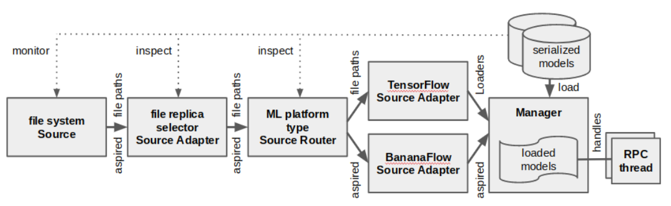

<!--Copyright © Microsoft Corporation. All rights reserved.
  适用于[License](https://github.com/microsoft/AI-System/blob/main/LICENSE)版权许可-->

# 8.4 部署

- [8.4 部署](#84-部署)
  - [8.4.1 可靠性和可扩展性](#841-可靠性和可扩展性)
  - [8.4.2 部署灵活性](#842-部署灵活性)
  - [8.4.3 模型转换与开放协议](#843-模型转换与开放协议)
  - [8.4.4 模型版本管理，线上发布，回滚策略](#844-模型版本管理线上发布回滚策略)
  - [8.4.5 移动端部署](#845-移动端部署)
  - [8.4.6 代表性推理芯片](#846-代表性推理芯片)
  - [小结与讨论](#小结与讨论)
  - [参考文献](#参考文献)

推理系统进行模型部署时，需要应对多样的框架，多样的部署硬件，以及持续集成和持续部署的模型上线发布等诸多的问题，本小节将围绕部署过程中涉及到的各种问题进行展开。

## 8.4.1 可靠性和可扩展性

需要对不一致的数据，软件、用户配置和底层执行环境故障等造成的中断有弹性(resilient)。同时推理系统必须优雅地扩展当处于生产环境中流量的增加的场景。推理系统在设计之初就需要考虑提供更好的扩展性。推理系统随着请求负载增加而自动和动态的部署更多的实例，进而才可以应对更大负载，提供更高的推理吞吐和让推理系统更加可靠。

如图所示，通过底层的部署平台（例如，Kubernetes）的支持，可以部署多个推理服务的副本，通过前端服务达到负载均衡，进而达到更高的扩展性，同时更多的副本也使得推理服务有了更高的可靠性。

 

图8-4-1. Kubernetes部署训练和推理服务

## 8.4.2 部署灵活性

服务系统需要支持多样的框架，并和其他系统服务进行交互。总结起来服务系统需要灵活性的原因：
  - 支持加载不同框架的模型
  - 框架不断的更新，大多数是为训练优化，有些框架甚至不支持在线推理
  - 与不同语言接口和不同逻辑的应用结合
  
解决方法：
- 接口抽象:
  - 提供构建不同应用逻辑的灵活性
  - 提供不同框架的通用抽象
- 跨进程通信(RPC)：
  - 跨语言，跨进程通信
- 深度学习模型开放协议：
  - 跨框架模型转换
- 容器：
  - 运行时环境依赖与资源隔离

## 8.4.3 模型转换与开放协议

由于目前存在很多深度学习框架已经开源，并可以被开发者选用，同时很多公司自研深度学习框架，并通过相应的框架开源预训练模型。这样一种生态造成有人工智能业务的公司切换，微调和部署模型的工程成本较高，频繁切换模型和需要自研模型转换工具。为了缓解这个痛点，业界有相应的两大类工作来缓解当前问题。

- 模型中间表达标准：ONNX 
  - 模型中间表达标准
  - 模型优化与部署(ONNX Runtime)
- 模型转换工具：MMdnn
  - 模型通过中间表达(IR)跨框架转换

 

图8-4-2. 模型构建与部署

## 8.4.4 模型版本管理，线上发布，回滚策略

 

图8-4-2. 模型构建与部署

推理系统本身就像传统Web服务发布代码包一样，需要定期发布模型，提供新功能或更好的效果。因为推理服务需要提供模型管理功能，需要模型版本管理的原因：
  - 每隔一段时间训练出的新版本模型替换线上模型，但是可能存在缺陷
  - 如果新版本模型发现缺陷需要回滚

模型生命周期管理常用的策略：
  - 金丝雀(Canary)策略
  - 回滚(Rollback)策略

具体的来说金丝雀(Canary)和回滚(Rollback)策略

- 金丝雀策略
  - 当获得一个新训练的模型版本时，当前服务的模型成为第二新版本(second-newest)时，用户可以选择同时保持这两个版本
  - 将所有推理请求流量发送到当前两个版本，比较它们的效果
  - 一旦对最新版本达标，用户就可以切换到仅该版本
  - 方法需要更多的高峰资源，避免将用户暴露于缺陷模型
- 回滚策略
  - 如果在当前的主要服务版本上检测到缺陷，则用户可以请求切换到特定的较旧版本
  - 卸载和装载的顺序应该是可配置的
  - 当问题解决并且获取到新的安全版本模型时，从而结束回滚

## 8.4.5 移动端部署

我们可以观察到，移动端部署应用常常有以下场景：
- 智能设备(Smart Devices)
- 智慧城市(Smart City)
- 互联工厂(Connected Factory) 
- 智慧办公室(Smart Office)
- 智能人体监测

相比移动端，云端部署模型特点与优势有以下几点：
- 对功耗(energy)、热量(thermal)、模型大小(model size)没有严格限制 
- 用于训练和推理的强大硬件
- 集中的数据管理有利于模型训练
- 模型更容易在云端得到保护 
- DNN执行平台统一 

但是云端部署推理服务也存在一定的问题：
- 云上提供所有AI服务成本高昂
- 部署严格的数据隐私问题(Data privacy)
- 数据传输成本(Data transfer cost)
- 推理服务依赖于网络的依赖
- 很难定制化(Model customization)模型

所以移动端推理常常需要需要考虑在端和云混合情况下提供AI服务。同时移动端部署也存在诸多挑战：
- 严格约束功耗、热量、模型大小（<10MB） 
- 硬件算力对推理服务来说不足
- 数据分散且难以训练 
- 模型在边缘更容易受到攻击 
- DNN平台多样，无通用解决方案 

在下图中，我们总结了移动端部署全景图：
- 应用层算法优化：
- 高效率模型设计：
- 移动端代表性框架：
- 移动端芯片：

 

图8-4-1. 并行启动执行作业可能产生的问题

## 8.4.6 代表性推理芯片

推理系统最终底层还是通过一定的芯片进行模型的矩阵计算的运算，我们可以通过以下一些代表性的芯片了解从硬件角度是如何针对推理任务的特点进行设计和优化的。

- Intel CPU
- Google TPU 
- NVIDIA 
  - 数据中心芯片：A100
  - 移动端芯片：Jetson
- 寒武纪Diannao
- FPGA

## 小结与讨论

本小节主要围绕推理系统的部署展开讨论，推理系统在部署模型时，需要考虑部署的扩展性，灵活性，版本管理，移动端部署等多样的问题，我们在本章针对这些问题总结了业界相关代表性的方法。

## 参考文献

- [Park, Jongsoo et al. “Deep Learning Inference in Facebook Data Centers: Characterization, Performance Optimizations and Hardware Implications.” ArXiv abs/1811.09886 (2018): n. pag.](https://arxiv.org/abs/1811.09886)
- [Crankshaw, Daniel et al. “Clipper: A Low-Latency Online Prediction Serving System.” NSDI (2017).](https://www.usenix.org/system/files/conference/nsdi17/nsdi17-crankshaw.pdf)
- [Denis Baylor, Eric Breck, Heng-Tze Cheng, Noah Fiedel, Chuan Yu Foo, Zakaria Haque, Salem Haykal, Mustafa Ispir, Vihan Jain, Levent Koc, Chiu Yuen Koo, Lukasz Lew, Clemens Mewald, Akshay Naresh Modi, Neoklis Polyzotis, Sukriti Ramesh, Sudip Roy, Steven Euijong Whang, Martin Wicke, Jarek Wilkiewicz, Xin Zhang, and Martin Zinkevich. 2017. TFX: A TensorFlow-Based Production-Scale Machine Learning Platform. In Proceedings of the 23rd ACM SIGKDD International Conference on Knowledge Discovery and Data Mining (KDD '17). Association for Computing Machinery, New York, NY, USA, 1387–1395. DOI:https://doi.org/10.1145/3097983.3098021](https://research.google/pubs/pub46484/)
- [Olston, Christopher et al. “TensorFlow-Serving: Flexible, High-Performance ML Serving.” ArXiv abs/1712.06139 (2017): n. pag.](https://arxiv.org/abs/1712.06139)
- [Jeong-Min Yun, Yuxiong He, Sameh Elnikety, and Shaolei Ren. 2015. Optimal Aggregation Policy for Reducing Tail Latency of Web Search. In Proceedings of the 38th International ACM SIGIR Conference on Research and Development in Information Retrieval (SIGIR '15). Association for Computing Machinery, New York, NY, USA, 63–72. DOI:https://doi.org/10.1145/2766462.2767708](https://www.microsoft.com/en-us/research/wp-content/uploads/2016/02/samehe-2015sigir.optimalaggregation.pdf)
- [Cheng, Yu et al. “A Survey of Model Compression and Acceleration for Deep Neural Networks.” ArXiv abs/1710.09282 (2017): n. pag.](https://arxiv.org/abs/1710.09282)
- [CSE 599W: System for ML - Model Serving](https://dlsys.cs.washington.edu/)
- https://developer.nvidia.com/deep-learning-performance-training-inference 
- [Han, Song et al. “Deep Compression: Compressing Deep Neural Network with Pruning, Trained Quantization and Huffman Coding.” arXiv: Computer Vision and Pattern Recognition (2016): n. pag.](https://arxiv.org/abs/1510.00149) 
- [Song Han, Jeff Pool, John Tran, and William J. Dally. 2015. Learning both weights and connections for efficient neural networks. In Proceedings of the 28th International Conference on Neural Information Processing Systems - Volume 1 (NIPS'15). MIT Press, Cambridge, MA, USA, 1135–1143.](https://arxiv.org/abs/1506.02626)
- [DEEP LEARNING DEPLOYMENT WITH NVIDIA TENSORRT](https://developer.nvidia.com/blog/deploying-deep-learning-nvidia-tensorrt/)
- [Jonathan Ragan-Kelley, Connelly Barnes, Andrew Adams, Sylvain Paris, Frédo Durand, and Saman Amarasinghe. 2013. Halide: a language and compiler for optimizing parallelism, locality, and recomputation in image processing pipelines. SIGPLAN Not. 48, 6 (June 2013), 519–530. DOI:https://doi.org/10.1145/2499370.2462176](https://people.csail.mit.edu/jrk/halide-pldi13.pdf)
- [Tianqi Chen, Thierry Moreau, Ziheng Jiang, Lianmin Zheng, Eddie Yan, Meghan Cowan, Haichen Shen, Leyuan Wang, Yuwei Hu, Luis Ceze, Carlos Guestrin, and Arvind Krishnamurthy. 2018. TVM: an automated end-to-end optimizing compiler for deep learning. In Proceedings of the 13th USENIX conference on Operating Systems Design and Implementation (OSDI'18). USENIX Association, USA, 579–594.](https://arxiv.org/abs/1802.04799)
- [8-bit Inference with TensorRT](https://on-demand.gputechconf.com/gtc/2017/presentation/s7310-8-bit-inference-with-tensorrt.pdf)
- [ADVANCED AI EMBEDDED SYSTEMS](https://www.nvidia.com/en-us/autonomous-machines/embedded-systems/)
- [Hot Chips 33](https://hc33.hotchips.org/)
- [The 19th ACM International Conference on Mobile Systems, Applications, and Services](https://www.sigmobile.org/mobisys/2021/program.html#ml)
- [NVIDIA AI INFERENCE TECHNICAL OVERVIEW](https://www.nvidia.com/en-us/data-center/resources/inference-technical-overview/)
- [Tutorial: Deep Learning Inference Optimizations for CPU](https://hc33.hotchips.org/assets/program/tutorials/HC2021.Intel.Guokai%20Ma.V2.pdf)
- [Reuther, A. et al. “Survey of Machine Learning Accelerators.” 2020 IEEE High Performance Extreme Computing Conference (HPEC) (2020): 1-12.](https://arxiv.org/pdf/2009.00993.pdf)
- https://www.nvidia.com/en-us/data-center/a100/