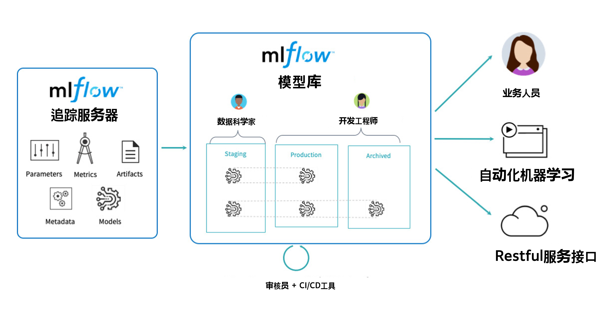

<!--Copyright © Microsoft Corporation. All rights reserved.
  适用于[License](https://github.com/microsoft/AI-System/blob/main/LICENSE)版权许可-->

# 8.5 MLOps

MLOps是一种用于人工智能(包含机器学习与深度学习)工程的方法，它将机器学习（例如，模型的训练与推理）开发与机器学习系统（深度学习框架，自动化机器学习系统）统一起来操作与维护（Ops部分）。MLOps的过程希望标准化和自动化机器学习全生命周期的关键步骤。MLOps 提供了一套标准化的流程和工具，用于构建、部署、快速可靠地运行机器学习全流程和机器学习系统。相比于传统的DevOps不同之处在于，当用户部署Web服务时，用户关心的是每秒查询数(QPS)、负载均衡(Load Balance)等。在部署机器学习模型时，用户还需要关注数据的变化、模型的变化等。这些是MLOps所要解决的新的挑战。 

- [8.5 MLOps](#85-mlops)
  - [8.5.1 MLOps的生命周期](#851-mlops的生命周期)
  - [8.5.2 深度学习模型管理](#852-深度学习模型管理)
  - [8.5.3 线上发布与回滚策略](#853-线上发布与回滚策略)
  - [8.6.4 代表性MLOps工具与服务](#864-代表性mlops工具与服务)
  - [小结与讨论](#小结与讨论)
  - [参考文献](#参考文献)

## 8.5.1 MLOps的生命周期

推理系统本身就像传统Web服务发布代码包一样，需要定期发布模型，提供新功能或更好的效果。
这些挑战类似于应用程序开发团队在创建和管理应用程序时面临的挑战。借鉴传统的软件工程最佳实践，业界使用了DevOps，这是管理应用程序开发周期操作的行业标准。为了应对深度学习全生命周期的挑战，组织需要一种将DevOps的敏捷性带入ML 生命周期的方法，业界称这种方法为[MLOps](https://docs.microsoft.com/en-us/learn/modules/start-ml-lifecycle-mlops/2-mlops-introduction)

 

图8-5-1. 模型构建与部署 

如图8-5-2所示的时序图，其中训练模型的循环我们已经在第7章介绍。那么训练完成的模型如何和推理系统建立联系呢，我们可以看到一般训练完成后经过以下一些步骤进行模型部署与推理：
1. 模型测试阶段：此步骤不是必须，一般在互联网在线服务中需要此步骤进行在线AB测试，分配真实流量进行功能性测试，一旦模型达标则可以进行模型部署阶段。同时本阶段需要做一定的性能等非功能性测试。一旦不达标针对非功能性指标，可以公共模型压缩，量化，编译优化等进行优化，如果对功能性指标，则需要重新继续训练。
2. 进行到模型部署阶段，需要用户进行针对的平台编译与代码生成，模型打包或者针对服务端制作镜像。一般可以部署到服务端或者移动端（边缘端）。一旦服务中出现问题，模型还可以通过一定策略进行回滚使用原来的模型。
3. 模型部署后则可以对用户请求进行服务，响应用户请求。例如，如果用户请求的是物体检测模型，则用户提交图片作为请求，模型推理进行物体检测，将物体检测的结果作为请求的响应再返回给用户。

整个过程也是不断随着开发者不断训练新的模型进而不断更新线上模型，提升应用的服务水准。

 

图8-5-2. 深度学习的全生命周期图 (<a href="">图片来源</a>)

接下来，我们以其中的代表性的问题进行介绍。

## 8.5.2 深度学习模型管理

在系统（System），软件工程（Software Engineering）社区，常常会看到有相应的微软深度学习模型管理的工作。我们整理了一些有趣且实用的工具方向，读者可以对感兴趣的工具进行尝试和使用。

- ***模型动物园(Model Zoo)***
Model Zoo是开源框架和公司组织机器学习和深度学习模型的常用方式。当前很多场景下由于使用预训练模型可以大幅减少训练代价，或者很多开发者没有足够资源从头训练造成集成预训练模型并进行微调的方式。例如图8-5-2.所示，[Hugging Face](https://huggingface.co/)就通过语言模型的Model Zoo不断拓展社区，用户不断在其模型动物园下载和微调（Fine-tuning）预训练模型，并形成语言模型场景应用广泛的工具和生态，使得当前很多自然语言场景下，用户常常使用Hugging Face库而不是底层的PyTorch或者TensorFlow构建模型。

 

图8-5-3. Hugging Face语言预训练模型动物园 （2022/5/11日） 

- ***模型转换***
由于框架之间互用预训练模型以及训练到部署的运行时环境不同，产生了模型转换的需求，这其中[MMdnn](https://github.com/microsoft/MMdnn)和[ONNX](https://onnx.ai/)为代表的工具正是为解决这个需求而产生。
- ***模型和搜索空间合法性（Validity）验证***
模型本身容易产生各种类型错误（Type Errors）。例如，超参数不合法（Illegal Hyperparameter），张量不匹配（Tensor Mismatch）等。有相关工作如[REFTY](https://www.microsoft.com/en-us/research/publication/refty-refinement-types-for-valid-deep-learning-models/), [Pythia](https://github.com/plast-lab/doop-mirror/blob/master/docs/pythia.md)等通过静态检测的方式在训练前提前验证和规避相应的错误，保证模型的结构正确性。
- ***模型调试器***
由于模型训练过程中，无论研究工作还是实际工作中充满了大量的技巧(Trick)，对于小白用户希望像专家一下进行模型的训练优化保证交付模型，为了应对这种需求，一些工具和云服务提供模型和训练过程的调试，这样让即使没有相关经验的用户也能训练出效果好的模型。例如，[Amazon SageMaker Debugger](https://docs.aws.amazon.com/sagemaker/latest/dg/train-debugger.html)是亚马逊推出的针对机器学习的调试器，实时调试、监控和分析训练作业、检测非收敛条件、通过消除瓶颈优化资源利用率、缩短训练时间并降低机器学习模型的成本。学术界中软工社区的工作[DeepDiagnosis ICSE 22](https://arxiv.org/pdf/2112.04036.pdf)提出自动化诊断的思路，通过在框架注册回调函数（Call Back）收集信息，自动化的分析当前的训练指标，给出用户错误位置定位，并给出修改建议。例如，其会分析，权重变化，激活问题，精确度没有升高，损失没有降低等问题，并定位问题位置并给出建议，例如调整学习率，不合适的数据等。

 

图8-5-4. DeepDiagnosis自动诊断和推荐修复 (<a href="https://arxiv.org/pdf/2112.04036.pdf">图片引用</a>) 

- ***特征分布监测***
由于很多实际场景中，数据不断的增长，造成原有的数据分布产生了变化，而人工智能模型又对数据分布的变化较为敏感，所以不断监测数据分布变化，并在一定条件下触发模型重新训练，也是整个生命周期中非常重要的环节。
- ***模型版本管理***
由于模型上线使用后并不是一劳永逸，随着数据分布变化，或算法工程师设计新的模型效果更好，需要不断上线新模型替代原有模型，这就要求当前的推理系统，或模型部署的服务器文件系统或者网络文件系统做好相应的模型版本管理和策略，方便模型更新与回滚。

## 8.5.3 线上发布与回滚策略

在MLOps中，其中较为重要的一个问题是模型的版本管理：线上发布，回滚等策略。因为近些年，软件逐渐由客户端软件演化为在线部署的服务，而模型最终也是部署于一定的软件系统中，所以越来越多的模型部署于在线服务(Online Service)中。在在线服务中， 每隔一段时间训练出的新版本模型替换线上模型，但是可能存在缺陷，另外如果新版本模型发现缺陷需要回滚。同时在整个模型的生命周期中，还有很多代表性的服务，工具和系统也越来越充当着非常重要的角色。

A/B测试：A/B测试是一种优化技术，通常用于了解更改的变量如何影响受众或用户参与度。这是营销、网页设计、产品开发和用户体验设计中用于提高活动和目标转化率的常用方法。A/B测试一般采用对用户流量进行分桶，即将其分成实验组和对照组用户，对实验组的用户部署新模型返回请求应答，对照组的用户沿用旧模型，在分桶的过程中，需要注意样本的独立性和无偏性，保证用户每次只能分到同一个桶中，最终验证新模型和旧模型的效果优势，如果有优势可以上线新模型。总结起来，对需要在线部署的模型，A/B测试有以下的好处和作用：1. 离线评估无法完全消除过拟合的影响。2. 离线评估无法完全还原线上的工程环境。例如，数据延迟、缺失等情况。3. 线上系统的某些评测指标在离线评估中无法计算。

 

图8-5-5. 推理系统中的模型生命周期管理管理

[图片引用](https://developer.nvidia.com/tensorrt)

如图8-5-1 所示，训练完成的模型被保存在模型库，并被推理系统所管理与加载，上线后还有遵循一定的策略保证正确性和可回滚。

模型生命周期管理的具体策略实例还有有：[TensorFlow-Serving中提出的金丝雀(canary)策略，回滚(rollback)策略](https://arxiv.org/pdf/1712.06139.pdf)。
- 金丝雀策略
  - 当获得一个新训练的模型版本时，当前服务的模型成为第二新版本时，用户可以选择同时保持这两个版本
  - 将所有推理请求流量发送到当前两个版本，比较它们的效果
  - 一旦对最新版本达标，用户就可以切换到仅使用最新版本
  - 该策略需要更多的高峰资源，避免将用户暴露于缺陷模型
- 回滚策略
  - 如果在当前的主要服务版本上检测到缺陷，则用户可以请求切换到特定的较旧版本
  - 卸载和装载的顺序应该是可配置的
  - 当问题解决并且获取到新的安全版本模型时，从而结束回滚

当然业界每家公司也会根据自身在线服务特点设计和定制个性化的策略和线上管理流程，其目标都是朝着敏捷不断迭代模型，可回滚，可靠等角度去设计和迭代优化的。

## 8.6.4 代表性MLOps工具与服务

- 开源MLOps工具：
  - [MLflow](https://mlflow.org/)：是由UCB开源的MLOps工具，其提供标准化的API，Python社区友好，并让MLOps概念深入人心。

 

图8-5-6. MLflow <a href="https://databricks.com/blog/2020/04/15/databricks-extends-mlflow-model-registry-with-enterprise-features.html)">图片引用</a> 

MLflow能够跟踪指标、参数和工件，打包模型和可重现的机器学习项目，并将模型部署到批处理或实时服务平台。基于这些现有功能，MLflow模型库供了一个中央存储库来管理模型部署生命周期。同时整个生命周期通过CI/CD进行管理，达到持续集成，持续部署。
- 公有云MLOps服务：
  - [Amazon SageMaker MLOps](https://aws.amazon.com/sagemaker/mlops/)：此服务为亚马逊云服务机器学习平台SageMaker提供的MLOps服务，其提供全流程的机器学习声明周期管理，并提供特色的模型调试与诊断功能，将专家级调试经验自动化。
  - [Azure Machine Learning](https://azure.microsoft.com/en-us/services/machine-learning/mlops/)：微软Azure Machine Learning服务也提供了MLOps的功能，并持续构建全套解决方法，与微软云集成度最佳。
  - [Google Cloud MLOps](https://cloud.google.com/resources/mlops-whitepaper)：Google Cloud的MLOps功能不仅较早提出，同时向业界发布白皮书，布道相关概念与技术。

## 小结与讨论

本章我们主要介绍目前比较火的概念MLOps，其实在人工智能开始工程化的时间节点，MLOps已经发生了，我们借鉴软件工程和DevOps的成熟理论，让人工智能基础架构更加稳定和高效。

## 参考文献

- [Park, Jongsoo et al. “Deep Learning Inference in Facebook Data Centers: Characterization, Performance Optimizations and Hardware Implications.” ArXiv abs/1811.09886 (2018): n. pag.](https://arxiv.org/abs/1811.09886)
- [Crankshaw, Daniel et al. “Clipper: A Low-Latency Online Prediction Serving System.” NSDI (2017).](https://www.usenix.org/system/files/conference/nsdi17/nsdi17-crankshaw.pdf)
- [Denis Baylor, Eric Breck, Heng-Tze Cheng, Noah Fiedel, Chuan Yu Foo, Zakaria Haque, Salem Haykal, Mustafa Ispir, Vihan Jain, Levent Koc, Chiu Yuen Koo, Lukasz Lew, Clemens Mewald, Akshay Naresh Modi, Neoklis Polyzotis, Sukriti Ramesh, Sudip Roy, Steven Euijong Whang, Martin Wicke, Jarek Wilkiewicz, Xin Zhang, and Martin Zinkevich. 2017. TFX: A TensorFlow-Based Production-Scale Machine Learning Platform. In Proceedings of the 23rd ACM SIGKDD International Conference on Knowledge Discovery and Data Mining (KDD '17). Association for Computing Machinery, New York, NY, USA, 1387–1395. DOI:https://doi.org/10.1145/3097983.3098021](https://research.google/pubs/pub46484/)
- [Olston, Christopher et al. “TensorFlow-Serving: Flexible, High-Performance ML Serving.” ArXiv abs/1712.06139 (2017): n. pag.](https://arxiv.org/abs/1712.06139)
- https://www.microsoft.com/en-us/research/project/ai-tooling-and-mlops/
- https://zhuanlan.zhihu.com/p/59685112
- ttps://docs.microsoft.com/en-us/learn/modules/start-ml-lifecycle-mlops/2-mlops-introduction
- https://aws.amazon.com/sagemaker/mlops/
- https://azure.microsoft.com/en-us/services/machine-learning/mlops/
- https://cloud.google.com/resources/mlops-whitepaper
- [Industrializing AI for the Enterprise with 
NVIDIA DGX Systems and MLOps](https://www.nvidia.com/content/dam/en-zz/Solutions/Data-Center/dgx-ready-software/dgx-mlops-whitepaper.pdf)
- https://databricks.com/blog/2020/04/15/databricks-extends-mlflow-model-registry-with-enterprise-features.html