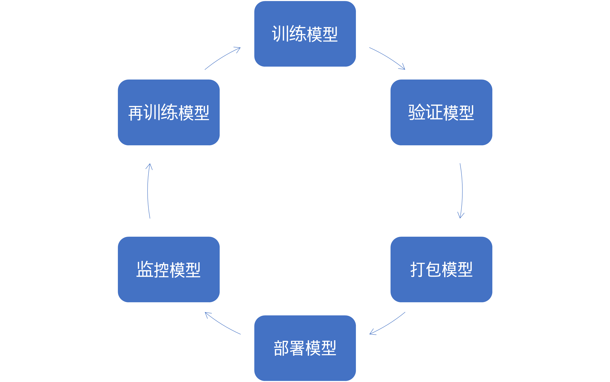
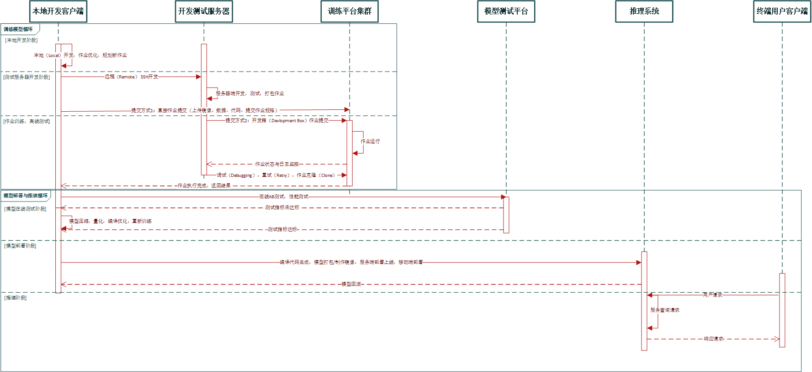
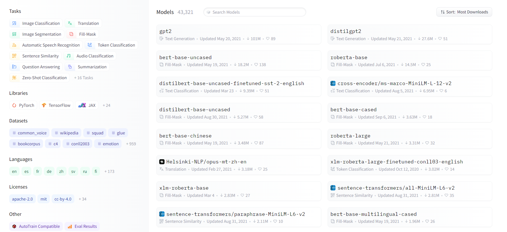
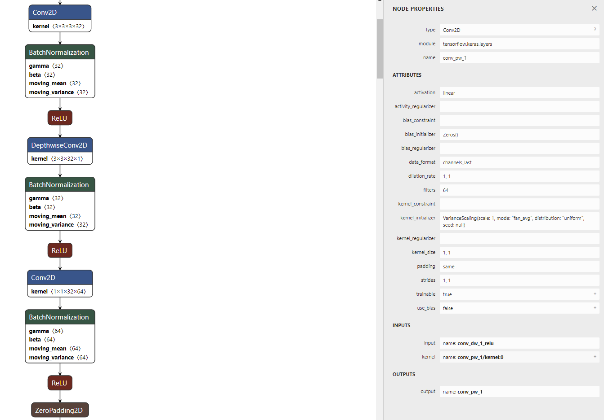
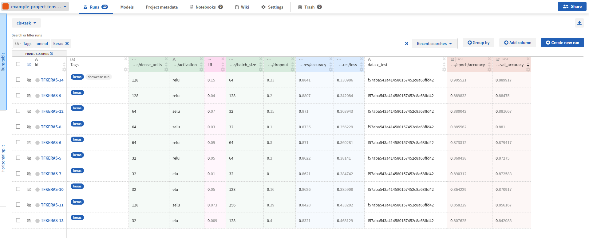
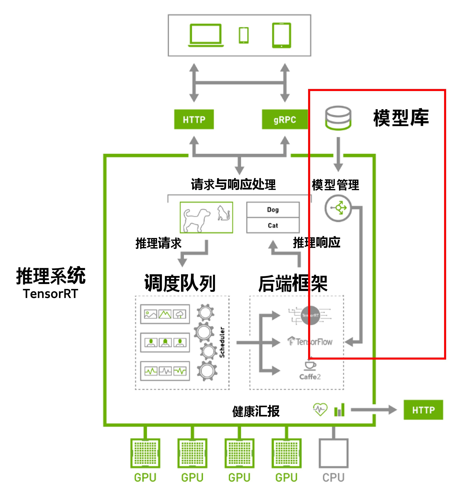
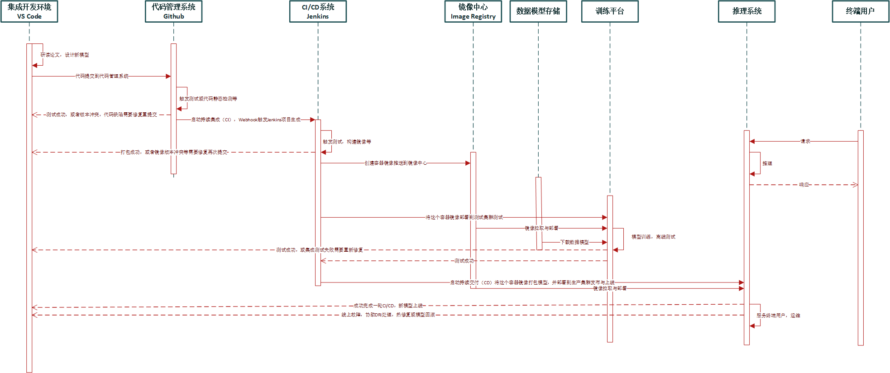

<!--Copyright © Microsoft Corporation. All rights reserved.
  适用于[License](https://github.com/microsoft/AI-System/blob/main/LICENSE)版权许可-->

# 8.5 开发、训练与部署的全生命周期管理-MLOps

MLOps 是一种用于人工智能（包含机器学习与深度学习）全生命周期的工程化方法，它借鉴 DevOps 思想将机器学习（例如，模型的训练与推理）开发（Dev 部分）与机器学习系统（深度学习框架，自动化机器学习系统）统一起来操作与维护（Ops 部分）。MLOps 的过程希望标准化和自动化机器学习全生命周期的关键步骤。MLOps 提供了一套标准化的流程和工具，用于构建、部署、快速可靠地运行机器学习全流程和机器学习系统。相比于传统的 DevOps 不同之处在于，当用户部署 Web 服务时，用户关心的是每秒查询数（QPS）、负载均衡（Load Balance）等。在部署机器学习模型时，用户还需要关注模型准确度，数据的变化、模型的变化等。这些是 MLOps 所要解决的新的挑战。 

- [8.5 开发、训练与部署的全生命周期管理-MLOps](#85-开发训练与部署的全生命周期管理-mlops)
  - [8.5.1 MLOps 的生命周期](#851-mlops-的生命周期)
  - [8.5.2 MLOps工具链（Toolchain）](#852-mlops工具链toolchain)
  - [8.5.3 线上发布与回滚策略](#853-线上发布与回滚策略)
  - [8.6.4 MLOps 持续集成，持续交付（CI/CD）](#864-mlops-持续集成持续交付cicd)
  - [8.6.5 MLOps 工具与服务](#865-mlops-工具与服务)
  - [小结与讨论](#小结与讨论)
  - [参考文献](#参考文献)

## 8.5.1 MLOps 的生命周期

推理系统本身就像传统 Web 服务发布代码包一样，需要定期发布模型，提供新功能或更好的效果。
类似于传统软件工程中应用程序开发团队在创建和管理应用程序。借鉴传统的软件工程最佳实践，业界使用了 DevOps，这是管理应用程序开发周期操作的行业标准。为了应对深度学习全生命周期的挑战，如图 8.5.1 所示，组织需要一种将 DevOps 的思想带入机器学习生命周期的方法，业界称这种方法为 [MLOps](https://docs.microsoft.com/en-us/learn/modules/start-ml-lifecycle-mlops/2-mlops-introduction)[<sup>[1]</sup>](#mlops)

<center> </center>
<center>图 8.5.1 模型构建与部署 </center>

如图 8.5.2 所示的时序图，其中训练模型的循环我们已经在第 7 章介绍。那么训练完成的模型如何和推理系统建立联系呢，我们可以看到一般训练完成后经过以下一些步骤进行模型部署与推理：
1. 模型测试阶段，一般此阶段含有功能性测试（离线测试和在线 [A/B 测试](https://en.wikipedia.org/wiki/A/B_testing)等）和非功能性测试（性能测试等）。一般在互联网在线服务中需要先进行离线测试数据测试，测试达标后进行在线 A/B 测试，分配真实流量进行功能性测试，一旦模型达标则可以进行模型部署阶段。同时本阶段需要做一定的非功能性测试，例如测试性能等。一旦不达标针对非功能性指标，可以通过模型压缩，量化，编译优化等进行优化，如果对功能性指标不达标，则需要重新训练与调优。
2. 进行到模型部署阶段，需要用户进行针对的平台编译与代码生成，模型打包或者针对服务端制作镜像。一般可以部署到服务端或者移动端（边缘端）。一旦服务中出现问题，模型还可以通过一定策略进行回滚使用原来的模型。
3. 模型部署后则可以对用户请求进行服务，也就是我们所说的模型推理（Inference）过程，响应用户请求。例如，如果用户请求的是物体检测模型，则用户提交图片作为请求，模型推理进行物体检测，将物体检测的结果作为请求的响应再返回给用户。

整个过程不断随着开发者研发训练新的模型不断更新线上模型，提升应用的服务水准。
<center> </center>
<center>图 8.5.2 深度学习的全生命周期图 （点击图片查看大图）</center>

接下来，我们以 MLOps 中的代表性的问题进行介绍。

***相关概念解释***

A/B 测试：通常用于在线推理服务中，是模型上线前的在线测试环节。A/B 测试一般采用对用户流量进行分桶，即将其分成实验组和对照组用户，对实验组的用户部署新模型返回请求应答，对照组的用户沿用旧模型，在分桶的过程中，需要注意样本的独立性和无偏性，保证用户每次只能分到同一个桶中，最终验证新模型和旧模型的效果优势，如果有优势可以上线新模型。对需要在线部署的模型，A/B 测试有以下的好处：
1. 离线评估测试无法完全消除过拟合的影响。
2. 离线评估无法完全还原线上的工程环境。例如，数据延迟、缺失等情况。
3. 线上系统的某些评测指标在离线评估中无法计算，例如，实时点击率等。

## 8.5.2 MLOps工具链（Toolchain）

在系统（System），软件工程（Software Engineering）社区，常常会看到有相应的深度学习模型管理的工作，我们也可以将其拓展为覆盖整个 MLOps 的工具链。我们整理了一些有趣且实用的工具和相关工作，读者可以对感兴趣的工具进行尝试和使用。

- ***模型动物园（Model Zoo）***
模型动物园（Model Zoo）是开源框架和公司开源与组织机器学习和深度学习预训练模型的常用方式。当前很多场景下由于使用预训练模型可以大幅减少训练代价，或者很多开发者没有足够资源从头训练造成集成预训练模型并进行微调的方式。例如图 8.5.3 所示，[Hugging Face](https://huggingface.co/)[<sup>[2]</sup>](#huggingface) 就通过语言模型的 Model Zoo 不断拓展社区，用户不断在其模型动物园下载和微调（Fine-tuning）预训练模型，并形成语言模型场景应用广泛的工具和生态，使得当前很多自然语言场景下，用户常常使用 Hugging Face 库而不是底层的 PyTorch 或者 TensorFlow 构建模型。

<center> </center>
<center>图 8.5.3 Hugging Face 语言预训练模型动物园 （2022/5/11 日数据） </center>

如 MMdnn[<sup>[3]</sup>](#mmdnn) 中提供的早期 CV 模型实例，模型动物园中需要提供，预训练模型的二进制文件，原始链接，模型的原始规格等。

图 8.5.1 MMdnn 模型动物园

| | | |
|-|-|-|
|<b>alexnet</b><br />Framework: caffe<br />Download: [prototxt](https://raw.githubusercontent.com/BVLC/caffe/master/models/bvlc_alexnet/deploy.prototxt) [caffemodel](http://dl.caffe.berkeleyvision.org/bvlc_alexnet.caffemodel) <br />Source: [Link](https://github.com/BVLC/caffe/tree/master/models/bvlc_alexnet)<br />|<b>inception_v1</b><br />Framework: caffe<br />Download: [prototxt](https://raw.githubusercontent.com/BVLC/caffe/master/models/bvlc_googlenet/deploy.prototxt) [caffemodel](http://dl.caffe.berkeleyvision.org/bvlc_googlenet.caffemodel) <br />Source: [Link](https://github.com/BVLC/caffe/tree/master/models/bvlc_googlenet)<br />|<b>vgg16</b><br />Framework: caffe<br />Download: [prototxt](https://gist.githubusercontent.com/ksimonyan/211839e770f7b538e2d8/raw/c3ba00e272d9f48594acef1f67e5fd12aff7a806/VGG_ILSVRC_16_layers_deploy.prototxt) [caffemodel](http://data.mxnet.io/models/imagenet/test/caffe/VGG_ILSVRC_16_layers.caffemodel) <br />Source: [Link](https://gist.github.com/ksimonyan/211839e770f7b538e2d8/)<br />
|<b>vgg19</b><br />Framework: caffe<br />Download: [prototxt](https://gist.githubusercontent.com/ksimonyan/3785162f95cd2d5fee77/raw/bb2b4fe0a9bb0669211cf3d0bc949dfdda173e9e/VGG_ILSVRC_19_layers_deploy.prototxt) [caffemodel](http://data.mxnet.io/models/imagenet/test/caffe/VGG_ILSVRC_19_layers.caffemodel) <br />Source: [Link](https://gist.github.com/ksimonyan/3785162f95cd2d5fee77)<br />|<b>resnet50</b><br />Framework: caffe<br />Download: [prototxt](http://data.mxnet.io/models/imagenet/test/caffe/ResNet-50-deploy.prototxt) [caffemodel](http://data.mxnet.io/models/imagenet/test/caffe/ResNet-50-model.caffemodel) <br />Source: [Link](http://data.mxnet.io/models/imagenet/test/caffe/)<br />|<b>resnet101</b><br />Framework: caffe<br />Download: [prototxt](http://data.mxnet.io/models/imagenet/test/caffe/ResNet-101-deploy.prototxt) [caffemodel](http://data.mxnet.io/models/imagenet/test/caffe/ResNet-101-model.caffemodel) <br />Source: [Link](http://data.mxnet.io/models/imagenet/test/caffe/)<br />
|<b>resnet152</b><br />Framework: caffe<br />Download: [prototxt](http://data.mxnet.io/models/imagenet/test/caffe/ResNet-152-deploy.prototxt) [caffemodel](http://data.mxnet.io/models/imagenet/test/caffe/ResNet-152-model.caffemodel) <br />Source: [Link](http://data.mxnet.io/models/imagenet/test/caffe/)<br />|<b>squeezenet</b><br />Framework: caffe<br />Download: [prototxt](https://raw.githubusercontent.com/DeepScale/SqueezeNet/master/SqueezeNet_v1.1/deploy.prototxt) [caffemodel](https://github.com/DeepScale/SqueezeNet/raw/master/SqueezeNet_v1.1/squeezenet_v1.1.caffemodel) <br />Source: [Link](https://github.com/DeepScale/SqueezeNet/tree/master/SqueezeNet_v1.1)<br />|

用户可以通过以下命令使用模型动物园：

安装工具

```bash
pip install mmdnn
```

下载 TensorFlow 预训练模型
- [x] **方法 1:** 直接通过文档链接下载
- [x] **方法 2:** 使用命令行工具，Hugging Face 等工具也是将模型自动下载集成进工具本身，方便用户在微调场景使用。

```bash
$ mmdownload -f tensorflow -n vgg19

Downloading file [./vgg_19_2016_08_28.tar.gz] from [http://download.tensorflow.org/models/vgg_19_2016_08_28.tar.gz]
progress: 520592.0 KB downloaded, 100%
Model saved in file: ./imagenet_vgg19.ckpt
```

***经典回顾***

模型动物园类似传统[包管理器（Packge Management System）](https://en.wikipedia.org/wiki/Package_manager)或者镜像中心（Docker Hub），提供模型的集合，下载与安装管理。“例如包管理器以一致的方式自动执行安装、升级、配置和删除计算机程序包，镜像中心汇聚开源的镜像并提供统一的接口让用户方便下载与管理。但是相比传统的包管理器，目前的模型动物园还稍显简陋，例如一般提供，元数据（名称、用途描述、版本号、供应商，校验和），但是相比包，目前由于模型一般依赖较少的预训练模型，所以还没有达到复杂的依赖管理，相比包管理这点上来看更加简单。但是相比传统程序，目前很多模型权重直接暴露，较少做传统二进制程序混淆，会产生一定安全与隐私风险，读者可以参考第 12 章了解如何针对深度学习模型进行安全和隐私保护。”

- ***模型和工作流可视化***

深度学习模型可视化能够让开发者更好的（1）调试（2）理解（3）设计深度学习模型，并在平时的开发过程中被得以越来越多的使用。例如，我们可以通过 [Netron](https://github.com/lutzroeder/netron)[<sup>[4]</sup>](#netron)，[MMdnn](https://github.com/microsoft/MMdnn/tree/master/mmdnn/visualization)[<sup>[3]</sup>](#mmdnn) 等工具进行模型结构可视化。读者可以参考如下实例体验可视化过程：
1. 准备模型文件，可以导出或者从模型动物园下载
2. 安装 Netron
3. 将模型文件拖拽到 Netron
4. 可视化与交互，读者可以从可视化界面中观察到，模型数据流图，算子类型，超参数和张量尺寸等信息。
如图 8.5.4，我们下载 Keras MobileNet 并通过 Netron 可视化，我们点击一个 Conv2D 可以看到其超参数和输入输出张量尺寸。
<center> </center>
<center>图 8.5.4 Netron 可视化 Keras MobileNet</center>

工作流可视化的方式可以以低代码的形式（1）减少代码开发，提升生产力（2）同时促进模块化复用组件，对一般较为成熟的平台会一般逐渐朝着通过工作流方式增加组织核心模块和功能复用性，减少重复开发二次劳动。对整个开发的流程，很多公司也开发了可视化低代码的开发接口，进行工作流拖拽式编程，让用户可以快速搭建机器学习流水线，复用模块。例如 [Azure Machine Learning designer](https://docs.microsoft.com/en-us/azure/machine-learning/concept-designer)，如下图实例，用户可以配置一个工作流中的模块，进行数据清洗，整个过程无需书写代码。

<center> </center>
<center>图 8.5.5 可视化机器学习流水线工作流 (<a href="https://docs.microsoft.com/en-us/azure/machine-learning/concept-designer">图片引用 Azure 文档</a>) </center>

***经典回顾***

[可视化编程语言（Visual Programming Language）](https://en.wikipedia.org/wiki/Visual_programming_language)：“可视化编程语言是允许用户通过以图形方式操作程序元素而不是通过文本指定它们来创建程序的编程语言。其使用视觉表达、文本和图形符号的空间排列进行编程，用作语法元素或辅助符号。以 ASP.NET ，Scratch 等代表的可视化编程方式，可视化编程方法常常与数据流编程语言集成。”机器学习流水线就可以抽象为数据流（Dataflow Graph），进而通过可视化编程的方式自动生成程序和文档。

- ***模型转换***

由于框架之间互用预训练模型以及训练到部署的运行时环境不同，产生了模型转换的需求，这其中 [MMdnn](https://github.com/microsoft/MMdnn) 和 [ONNX](https://onnx.ai/) 为代表的工具正是为解决这个需求而产生。在程序语言中，模型转换可以认为是一种源到源的编译器（Source-to-source Compiler）。但是相比传统的单纯代码进行转换，在模型转换中遇到了新的挑战，就是其中有权重，且转换可能会有数值影响，这时此问题的核心挑战成为，如何能保证转换的可信性（Faithful）。

***经典回顾***

[源到源编译器（Source-to-source Compiler）](https://en.wikipedia.org/wiki/Source-to-source_compiler)：“源到源编译器也称作 Transpiler 是一种翻译器，它获取以编程语言编写的程序的源代码作为其输入，并以相同或不同的编程语言生成等效的源代码。相比编译器是由高层语言到字节码或者机器码等低级语言的转换，Transpiler 更多是同层高级语言的转换，例如，Java 到 C++的转换。”模型转换也是类似是想通过 A 框架使用 B 框架发布的预训练模型。


- ***程序，模型和搜索空间合法性（Validity）验证***

在深度学习开发过程中以及在企业级平台上，深度学习程序本身容易产生缺陷造成任务失败。在 ICSE '22 的微软对其深度学习平台程序缺陷的[经验分析](https://dl.acm.org/doi/10.1145/3377811.3380362)[<sup>[5]</sup>](#empirical)中，我们可以观察到，作业失败有几大原因，深度学习相关，执行环境相关，通用代码相关，其中深度学习相关的缺陷中前三位为：GPU 内存溢出占整体 $8.8\%$，框架 API 错误使用占 $2.8\%$，张量不匹配占 $1.1\%$。

对于内存溢出等性能缺陷及合法性验证，可以通过分析模型进行代价预估，例如，相关工作 [DNNMem FSE '20](https://dl.acm.org/doi/abs/10.1145/3368089.3417050)通过[存活变量分析（Live-variable Analysis）](https://en.wikipedia.org/wiki/Live-variable_analysis)等手段，[DnnSAT 'ICSE 21](https://ieeexplore.ieee.org/document/9402095)通过将资源验证抽象为[资源约束满足问题（Constraint Satisfaction Problem）](https://en.wikipedia.org/wiki/Constraint_satisfaction_problem)，构建静态模型进行提前预估在作业提交前提前规避相应问题。

对张量不匹配问题，也可以通过静态分析方式提前规避。接下来我们以张量不匹配问题为例：如下代码实例所示，执行此模型将会在运行期产生异常。

```python
class TestModel(nn.Module):
    def __init__(self):
        super(TestModel, self).__init__()
        self.conv = nn.Conv2d(in_channels = 3, out_channels = 8, \
                              kernel_size = 3)
        self.pool = nn.AvgPool2d(kernel_size = 260, stride = 260)
        self.fc = nn.Linear(in_features = 1800, \
                            out_features = 10) 

    def forward(self, x):
        x = self.conv(x)
        x = self.pool(x)
        x = x.view(x.size(0), -1)
        x = self.fc(x)
        return x
```
控制台日志报错信息如下。
```shell
# Traceback (most recent call last):
...
# RuntimeError: Given input size: (8x222x222). Calculated output size: (8x0x0). Output size is too small
```

模型本身容易产生各种类型错误（Type Errors）。例如，超参数不合法（Illegal Hyperparameter），张量不匹配（Tensor Mismatch）等。有相关工作如 [Refty ICSE '22](https://www.microsoft.com/en-us/research/publication/refty-refinement-types-for-valid-deep-learning-models/)，[Pythia](https://github.com/plast-lab/doop-mirror/blob/master/docs/pythia.md) 等通过静态检测的方式在训练前提前验证和规避相应的错误，保证模型的结构正确性。

***经典回顾***

“类型系统的根本目的是防止在程序运行过程中发生执行错误。” - Cardelli, Luca (2004)

[类型系统（Type System）](https://en.wikipedia.org/wiki/Type_system)：“是由一组规则（Rule）组成的逻辑系统，这些规则将称为类型的属性分配给计算机程序的各种结构，例如变量、表达式、函数或模块。这些类型以形式化形式强制执行程序员用于约束数据的类型，函数的接口约定等。 类型系统通过定义计算机程序不同部分之间的接口，然后通过规则和一定的验证算法检查这些部分是否以一致的方式连接，从而减少程序缺陷（Bug）。类型系统还有其他用途，例如，给编译器优化提供暗示（Hint）、提供一种文档形式标注以增加代码可读性等。”那么在深度学习模型中，相比传统程序的基本类型，还需要考虑张量形状，维度，操作符超参数等特定领域的约束，这是面向深度学习类型系统所需要重新设计的。


- ***模型调试器***

由于模型训练过程中，无论研究工作还是实际工作中充满了大量的技巧（Trick），对于小白用户希望像专家一下进行模型的训练优化保证交付模型，为了应对这种需求，一些工具和云服务提供模型和训练过程的调试，这样让即使没有相关经验的用户也能训练出效果好的模型。例如，[Amazon SageMaker Debugger](https://docs.aws.amazon.com/sagemaker/latest/dg/train-debugger.html) 是亚马逊推出的针对机器学习的调试器，实时调试、监控和分析训练作业、检测非收敛条件、通过消除瓶颈优化资源利用率、缩短训练时间并降低机器学习模型的成本。学术界中软工社区的工作 [DeepDiagnosis ICSE '22](https://arxiv.org/pdf/2112.04036.pdf)[<sup>[6]</sup>](#deepdiagnosis) 提出自动化诊断的思路，通过在框架注册回调函数（Call Back）收集信息，自动化的分析当前的训练指标，给出用户错误位置定位，并给出修改建议。例如，权重变化，激活问题，精确度没有升高，损失没有降低等问题，并定位问题位置并给出建议，例如调整学习率，不合适的数据等。

<center> </center>
<center>图 8.5.6 DeepDiagnosis 自动诊断和推荐修复 (<a href="https://arxiv.org/pdf/2112.04036.pdf">图片引用 DeepDiagnosis ICSE '22</a>) </center>

模型调试器底层依赖对运行时的模型执行数值，学习曲线等指标进行监控和分析并给出推荐，下面的实例就是通过注册钩子，在程序中分析模型数值状况，进而我们可以理解模型调试器的工作原理。[本实例来源于 PyTorch 官方实例。](https://pytorch.org/tutorials/beginner/former_torchies/nnft_tutorial.html)

```python
import torch
import torch.nn as nn
import torch.nn.functional as F

class MNISTConvNet(nn.Module):
    def __init__(self):
        super(MNISTConvNet, self).__init__()
        self.conv1 = nn.Conv2d(1, 10, 5)
        self.pool1 = nn.MaxPool2d(2, 2)
        self.fc1 = nn.Linear(..., 50)

    def forward(self, input):
        x = self.pool1(F.relu(self.conv1(input)))
        x = x.view(x.size(0), -1)
        x = F.relu(self.fc1(x))
        return x

net = MNISTConvNet()
input = torch.randn(1, 1, 28, 28)

# 获取其前向传播的输入与输出张量并打印结果，或可以进行规范化处理
def printnorm(self, input, output):
    print('Inside ' + self.__class__.__name__ + ' forward')
    print('')
    print('input: ', type(input))
    print('input[0]: ', type(input[0]))
    print('output: ', type(output))
    print('')
    print('input size:', input[0].size())
    print('output size:', output.data.size())
    print('output norm:', output.data.norm())

# 注册前向传播针对 conv2 算子的钩子
net.conv2.register_forward_hook(printnorm)
out = net(input)
```

输出结果为：

```bash
Inside Conv2d forward

input:  <class 'tuple'>
input[0]:  <class 'torch.Tensor'>
output:  <class 'torch.Tensor'>

input size: torch.Size([1, 10, 12, 12])
output size: torch.Size([1, 20, 8, 8])
output norm: tensor(14.7081)
```

那么如果我们想增加更多的分析逻辑，就可以在运行时注册自定义函数来实现进行分析，调试与修复了。

***经典回顾***

[调试器（Debugger）](https://en.wikipedia.org/wiki/Debugger)：“调试器的主要用途是在受控条件下运行目标程序，允许程序员跟踪其正在进行的操作并监视计算机资源的变化。典型的调试包括在特定断点运行或停止目标程序、显示内存、CPU 寄存器等内容以及修改内存或寄存器内容以输入选定的测试数据。”所以，相比传统调试器我们可以看到，深度学习模型在训练或推理过程中，需要观测权重，激活值的变化，学习曲线的变化，进而反之动态调整学习率，批尺寸等影响模型效果的变量，缓解缺陷，提醒效果。

- ***模型与数据监控***

当前由于超参数变的越来越多，实验也越来越多，对模型和实验的监控与管理也变的越发重要。同时由于很多实际场景中，数据不断的增长，造成原有的数据分布产生了变化，而人工智能模型又对数据分布的变化较为敏感，所以不断监测数据分布变化，并在一定条件下触发模型重新训练，也是整个生命周期中非常重要的环节。

例如，用户在大规模 MLOps 实践过程中，可以对以下环节构建监控体系。
  - 模型学习性能：查看模型的预测有多准确。看看模型性能是否会随着时间的推移而衰减，进而决定是否需要重新训练。
  - 模型训练和再训练：在训练和再训练期间查看学习曲线（Learning Curve）、训练模型预测分布或混淆矩阵（Confusion Matrix）。
  - 输入/输出分布：查看模型中输入数据和特征的分布是否发生了变化。预测的类分布是否随时间变化、这些东西可能与数据漂移（Drift）有关。
  - 硬件指标：查看模型在训练和推理期间使用了多少 GPU，内存等硬件资源，甚至是多少费用。
  - CI/CD 流水线：查看来自 CI/CD 管道作业的评估并直观地比较它们。这样用户和机构能对当前整个流程和环节健康有清晰认识。

例如，Neptune[<sup>[7]</sup>](#neptune) 提供了一个展示[实例界面](https://app.neptune.ai/common/example-project-tensorflow-keras/experiments)，用户可以观察当前这类监控产品的监控项。我们可以观察到每个实验，模型训练效果，超参数配置等信息，综合管理实验。

<center> </center>
<center>图 8.5.7 Neptune模型与实验监控 (<a href="https://app.neptune.ai/common/example-project-tensorflow-keras/experiments?split=tbl&dash=charts&viewId=44675986-88f9-4182-843f-49b9cfa48599">图片引用 Neptune 文档</a>) </center>

一些开源系统中，例如 NNI[<sup>[8]</sup>](#nni)，MLflow[<sup>[9]</sup>](#mlflow) 也提供模型及实验监控追踪功能。通过 NNI 的界面，我们可以观察到实验，模型训练效果，超参数配置等信息，综合管理实验，还可以看到超参数的相关性等针对超参数搜索场景的信息。

<center> </center>
<center>图 8.5.8 NNI 模型与实验监控 (<a href="https://github.com/microsoft/nni/blob/master/docs/static/img/webui.gif">图片引用 NNI 文档</a>) </center>

- ***模型版本管理***

由于模型上线使用后并不是一劳永逸，随着数据分布变化，或算法工程师设计新的模型效果更好，需要不断上线新模型替代原有模型。这就要求当前的推理系统，模型部署的服务器文件系统或者网络文件系统做好相应的模型版本管理和策略，方便模型更新与回滚。

我们以 NVIDIA [Triton 推理服务器的版本管理文档实例](https://github.com/triton-inference-server/server/blob/main/docs/model_configuration.md#version-policy)[<sup>[10]</sup>](#triton)为例：每个模型都有一个或多个版本。在模型配置文件中，模型版本策略属性可以设置以下的策略：

- 全部（All)：模型存储库中可用的所有模型版本都可用于推理。配置如下版本策略：
  ```version_policy: { all: {}}```

- 最新（Latest）: 只有存储库中模型的最新 “n” 个版本可用于推理。模型的最新版本是数字最大的版本号。配置如下版本策略：
  ```version_policy: { latest: { num_versions: 2}}```

- 特定（Specific）: 只有模型的特别列出的版本可用于推理。配置如下版本策略：
  ```version_policy: { specific: { versions: [1,3]}}```

如果没有配置模型版本策略 *Latest* (配置 n=1) 作为默认配置，代表推理系统会使用最新的版本模型。

如下实例（[实例来源 Triton 文档](https://github.com/triton-inference-server/server/blob/main/docs/model_configuration.md#version-policy)）[<sup>[11]</sup>](#tritonversion)，Triton规定，最小模型配置必须指定平台和/或后端属性 platform 、最大批尺寸 max_batch_size 属性以及模型的输入和输出张量 input，output。

```yaml
  # 平台类型
  platform: "tensorrt_plan"
  # 最大推理批尺寸
  max_batch_size: 8
  # 每个模型输入和输出都必须指定名称、数据类型和形状。 为输入或输出张量指定的名称必须与模型预期的名称相匹配。
  input [
    {
      name: "input0"
      data_type: TYPE_FP32
      dims: [ 16 ]
    },
    {
      name: "input1"
      data_type: TYPE_FP32
      dims: [ 16 ]
    }
  ]
  output [
    {
      name: "output0"
      data_type: TYPE_FP32
      dims: [ 16 ]
    }
  ]
  # 配置模型版本管理策略
  version_policy: { all { }}
```

***经典回顾***

[代码版本管理（Code Version Control）](https://en.wikipedia.org/wiki/Version_control)：“是一类负责管理对计算机程序、文档、等信息集合的更改的系统。版本控制是软件配置管理的一个组成部分。”而当前的模型版本管理其实也可以纳入到已有的版本管理大家族中，并利用经典的版本管理工具，例如 Git 等进行深度学习模型更新的记录，防止冲突，回滚管理等。目前的模型版本管理更多是从模型整体是否发生变化入手，粒度较粗，传统程序可以细化到代码行，字符级别的变更管理，所以如果随着模型模块化解耦的发展，也可能会产生类似传统程序的细粒度版本管理。

## 8.5.3 线上发布与回滚策略

在 MLOps 中，其中较为重要的一个问题是模型的版本管理：线上发布，回滚等策略。因为近些年，软件逐渐由客户端软件演化为在线部署的服务，而模型最终也是部署于一定的软件系统中，所以越来越多的模型部署于在线服务（Online Service）中。在线服务每隔一段时间训练出的新版本模型替换线上模型，但是可能存在缺陷（Defect），另外如果新版本模型发现缺陷需要回滚。同时在整个模型的生命周期中，还有很多代表性的服务，工具和系统也越来越充当着非常重要的角色。

<center> </center>
<center>图 8.5.9 推理系统中的模型生命周期管理管理</center>

如图 8.5.9 所示，训练完成的模型被保存在模型库，并被推理系统所管理与加载，上线后还有遵循一定的策略保证正确性和可回滚。

接下来，我们以[TensorFlow-Serving 中提出的金丝雀（Canary）策略，回滚（Roll Back）策略](https://arxiv.org/pdf/1712.06139.pdf)[<sup>[12]</sup>](#tfserve)介绍模型生命周期管理的具体策略：
“
- 金丝雀策略
  - 当获得一个新训练的模型版本时，当前服务的模型成为第二新版本时，用户可以选择同时保持这两个版本
  - 将所有推理请求流量发送到当前两个版本，比较它们的效果
  - 一旦对最新版本达标，用户就可以切换到仅使用最新版本
  - 该策略需要更多的高峰资源，避免将用户暴露于缺陷模型
- 回滚策略
  - 如果在当前的主要服务版本上检测到缺陷，则用户可以请求切换到特定的较旧版本，卸载和装载的顺序应该是可配置的
  - 当问题解决并且获取到新的安全版本模型时，从而结束回滚
”

当然业界每家公司也会根据自身在线服务特点设计和定制个性化的策略和线上管理流程，其目标都是朝着敏捷，不断迭代模型，可回滚等角度去设计和迭代优化的。

## 8.6.4 MLOps 持续集成，持续交付（CI/CD）

<center> </center>
<center>图 8.5.10 MLOps持续集成，持续交付（CI/CD）的时序图实例 （点击图片查看大图）</center>

如图 8.5.10 本实例涉及一个机器学习算法工程师开发一个新模型并上线到推理系统服务的 DevOps 流水线（Pipeline）。 图中流程如下：

1. 算法工程师更改设计新模型，并更改当前项目程序源代码。
2. 所做的代码更改提交到源代码管理存储库，例如 GitHub。代码管理库触发一定测试，例如单元测试等。如果不通过，则算法工程师修复，并重走刚才的流程。
3. 为了启动持续集成 (CI) 过程，Webhook 会触发一个 Jenkins 项目生成。
4. Jenkins 触发一定的测试，构建镜像，并将镜像推送到镜像中心。如果不通过，则算法工程师修复，并重走刚才的流程。
5. Jenkins 通过之前定义好的流程，再触发系统到训练平台进行模型训练，拉取镜像，下载数据模型，启动训练作业，离线测试与验证，达到要求的模型存储到文件系统，并触发新的镜像构建。如果不通过，则算法工程师修复或优化模型，并重走刚才的流程。
6. Jenkins 通过持续部署 (CD) 将这个更新的容器映像部署到生产环境推理系统。如果不通过，则开发人员修复，并重走刚才的流程。
7. 终端用户不断向推理系统发起请求，返回响应，平台运维工程师进行线上推理系统服务运维。如果需要热修复推理系统性能和安全性问题，则运维工程师或者推理系统工程师服务修复。如果是模型缺陷或者学习性能（例如，准确度低等）不好则算法工程师修复，也可能触发自动回滚旧模型的策略，并重走刚才的流程。
8. 重复 1-8 的过程。

同时，请读者思考相比传统软件工程中的 CI/CD 的 DevOps 流程，在 MLOps 中我们遇到了哪些新的变化与挑战呢？
- 被管理的资产（Assets）：模型和数据相比以往代码更多。
- 大量的实验管理：传统程序需要程序员进行程序开发，而当前以实验驱动模型开发。
- 可解释性差：模型可解释性差，难以调试与问题诊断，更需要模型监控覆盖度更高。
- 进度管理：由于模型训练有很大非确定性，造成很难像传统软件工程进行工作量及交付时间预估。

***经典回顾***

我们仍可以参考 DevOps 领域的经典原则并将其用于 MLOps 中进而达到更敏捷和高质量的MLOps。
例如，Atlassian 总结了一份 [DevOps 原则](https://www.atlassian.com/devops/what-is-devops)[<sup>[13]</sup>](#devops)，我们可以参考应用到 MLOps：
“- 合作（Collaboration）：开发，运维和算法团队紧密协作。
- 自动化（Automation）：尽可能让 MLOps 全生命周期自动化。
- 持续提升（Continuous Improvement）：构建实验交付流水线，持续提升交付的模型效果。
- 以客户为中心的行动（Customer-Centric Action）：构建与终端使用模型的客户循环反馈，以客户需求为中心设计和优化流水线。
- 以终为始进行创作（Create With The End In Mind）：理解用户对模型的需求，构建解决实际需求的模型。避免因假设场景而创建的模型。”

## 8.6.5 MLOps 工具与服务

- 开源 MLOps 工具：
  - [MLflow](https://mlflow.org/)：是由 UCB 开源的 MLOps 工具，其提供标准化的 API，Python 社区友好。MLflow 能够跟踪指标、参数和工件，打包模型和可重现的机器学习项目，并将模型部署到批处理或实时服务平台。基于这些现有功能，MLflow 模型库供了一个中央存储库来管理模型部署生命周期。同时整个生命周期通过 CI/CD 进行管理，达到持续集成，持续部署。

- 公有云 MLOps 服务：
  - [Amazon SageMaker MLOps](https://aws.amazon.com/sagemaker/mlops/)：此服务为亚马逊云服务机器学习平台 SageMaker 提供的 MLOps 服务，其提供全流程的机器学习声明周期管理，并提供特色的模型调试与诊断功能，将专家级调试经验自动化。
  - [Azure Machine Learning](https://azure.microsoft.com/en-us/services/machine-learning/mlops/)：微软 Azure Machine Learning 服务也提供了 MLOps 的功能，并持续构建全套解决方法，与微软云集成度最佳。
  - [Google Cloud MLOps](https://cloud.google.com/resources/mlops-whitepaper)：Google Cloud 的 MLOps 功能不仅较早提出，同时向业界发布白皮书，布道相关概念与技术。

## 小结与讨论

本章我们主要介绍目前比较火的概念 MLOps，其实在人工智能开始工程化的时间点，MLOps 就已经发生了，我们借鉴软件工程和 DevOps 的成熟理论，让人工智能生命周期工程化，流程化，进而达到提升人工智能模型和产品研发的生产力。

## 参考文献

<div id="mlops"></div>

1.   [Introduction to MLOps and ML lifecycle](https://docs.microsoft.com/en-us/learn/modules/start-ml-lifecycle-mlops/2-mlops-introduction)

<div id="huggingface"></div>

2.   [Hugging Face](https://huggingface.co/)

<div id="mmdnn"></div>

3.   [Yu Liu, Cheng Chen, Ru Zhang, Tingting Qin, Xiang Ji, Haoxiang Lin, and Mao Yang. 2020. Enhancing the interoperability between deep learning frameworks by model conversion. Proceedings of the 28th ACM Joint Meeting on European Software Engineering Conference and Symposium on the Foundations of Software Engineering. Association for Computing Machinery, New York, NY, USA, 1320–1330.](https://dl.acm.org/doi/10.1145/3368089.3417051)

<div id="netron"></div>

4.   [Netron: Netron is a viewer for neural network, deep learning and machine learning models.](https://github.com/lutzroeder/netron)

<div id="empirical"></div>

5.   [Ru Zhang, Wencong Xiao, Hongyu Zhang, Yu Liu, Haoxiang Lin, and Mao Yang. 2020. An empirical study on program failures of deep learning jobs. In Proceedings of the ACM/IEEE 42nd International Conference on Software Engineering (ICSE '20). Association for Computing Machinery, New York, NY, USA, 1159–1170.](https://dl.acm.org/doi/10.1145/3377811.3380362)

<div id="deepdiagnosis"></div>

6.   [Wardat, Mohammad et al. “DeepDiagnosis: Automatically Diagnosing Faults and Recommending Actionable Fixes in Deep Learning Programs.” 2022 IEEE/ACM 44th International Conference on Software Engineering (ICSE) (2022): 561-572.](https://arxiv.org/abs/2112.04036)

<div id="neptune"></div>

7.   [Neptune](https://app.neptune.ai/common/example-project-tensorflow-keras/experiments)

<div id="nni"></div>

8.   [NNI (Neural Network Intelligence)](https://github.com/microsoft/nni)

<div id="mlflow"></div>

9.   [MLflow: An open source platform for the machine learning lifecycle](https://mlflow.org/)

<div id="triton"></div>

10.   [NVIDIA TRITON INFERENCE SERVER](https://developer.nvidia.com/nvidia-triton-inference-server)

<div id="tritonversion"></div>

11.   [Triton Version Policy](https://github.com/triton-inference-server/server/blob/main/docs/model_configuration.md#version-policy)

<div id="tfserve"></div>

12.    [Olston, Christopher et al. “TensorFlow-Serving: Flexible, High-Performance ML Serving.” ArXiv abs/1712.06139 (2017): n. pag.](https://arxiv.org/abs/1712.06139)

<div id="devops"></div>

13.   [Atlassian DevOps principles](https://www.atlassian.com/devops/what-is-devops)
