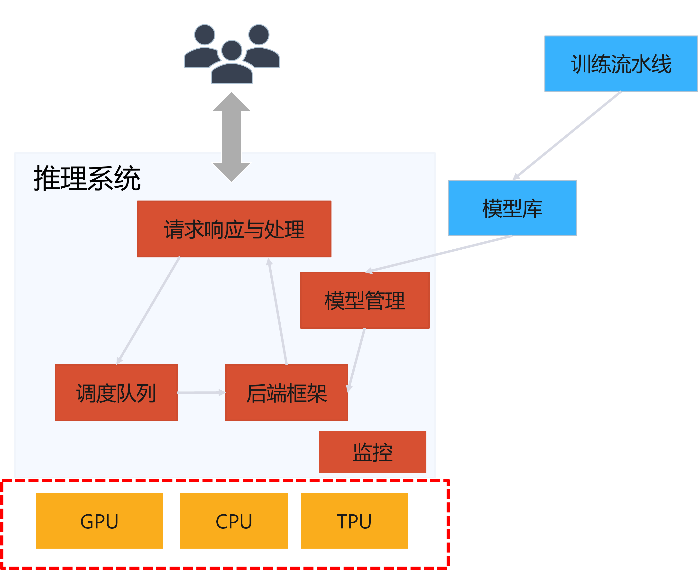
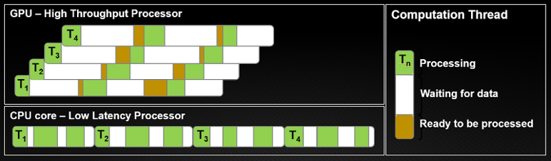
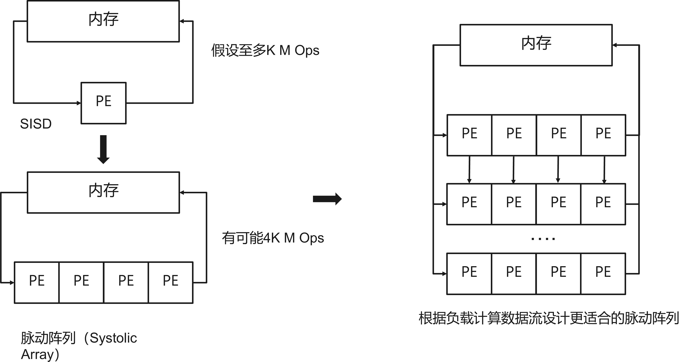

<!--Copyright © Microsoft Corporation. All rights reserved.
  适用于[License](https://github.com/microsoft/AI-System/blob/main/LICENSE)版权许可-->

# 8.6 推理专有芯片

 

图 8.6.1 推理系统与模型的部署 

- [8.6 推理专有芯片](#86-推理专有芯片)
  - [8.6.1 推理芯片架构对比](#861-推理芯片架构对比)
  - [8.6.2 神经网络推理芯片的动机和由来](#862-神经网络推理芯片的动机和由来)
  - [8.6.3 数据中心推理芯片](#863-数据中心推理芯片)
  - [8.6.4 边缘推理芯片](#864-边缘推理芯片)
  - [8.6.5 芯片模拟器](#865-芯片模拟器)
  - [小结与讨论](#小结与讨论)
  - [参考文献](#参考文献)

计算机架构的新黄金时代 “[A New Golden Age for Computer Architecture](https://www.doc.ic.ac.uk/~wl/teachlocal/arch/papers/cacm19golden-age.pdf)” -- John L. Hennessy, David A. Patterson。其指出，特定领域的硬件（Domain-specific Hardware），增强的安全性（Enhanced Security），开放的指令集（Open Instruction Sets），以及敏捷芯片开发（Agile Chip Development）等创新将引领潮流。计算系统的多样性趋势为计算机系统结构研究带来了又一个黄金时代。

[Chip Design Made Easy](https://en.wikibooks.org/wiki/Chip_Design_Made_Easy) 书中曾经将[芯片架构设计和建筑架构设计类比（Analogy of Chip Design Architecture Vs Building Architecture.）](https://en.wikibooks.org/wiki/Chip_Design_Made_Easy#Analogy_of_Chip_Design_Architecture_Vs_Building_Architecture.)。为什么要类比建筑架构？ 为了更好地理解芯片设计的概念，由于我们对建筑架构非常熟悉，那么我们很容易映射芯片设计架构，如图 8.6.2 所示。我们首先提供建筑物的平面图，同样我们提供芯片的平面图。基于连通性/可访问性，我们放置我们的房间，同样我们有放置块的约束。就像我们用砖块、窗户和其他模块建造建筑物一样，对于芯片设计，我们有组件库，就像预先设计的砖块，用于特定功能。现在让我们尝试了解我们建筑物中的电力结构或电气连接。最初，我们为我们的建筑制定了一个电气计划，我们要求我们所有的电气设备都需要供电。与此类似，我们有芯片功率要求。所需的电源通过电源焊盘提供，通过环形拓扑在芯片的所有角落均匀分布，并且电源必须到达所有标准单元（用于芯片设计的砖），这是在芯片设计中称为电网拓扑。还有很多其他方面可以进行类比。

 

图 8.6.2 芯片架构设计和建筑架构设计类比 <a href="">图片引用</a>

那么以此类比，我们接下来介绍一些深度学习推理芯片，背后是基于工业界希望设计并使用每单位计算性能，功耗和成本最低的芯片的诉求。这就像建筑行业在满足居住的功能性需求（对应芯片性能），不断提升工艺，降低成本和能耗。同时我们看到由于地皮空间有限（类比芯片晶圆），厂商需要根据功能需求（是酒店，还是公寓，还是学校），取舍一些功能间（类比去掉一些不需要支持的功能，排布更多计算单元），进而达到针对特定领域（酒店，学校，住宅）的最优设计。

## 8.6.1 推理芯片架构对比

深度学习模型常常部署在以下几种芯片中进行推理，不同的芯片有不同的特点，如图所示。

- CPU 部署：也有很多推理场景选择使用 CPU 推理，其中有几点原因。（1）推理阶段批尺寸小，造成浮点运算量低，常常 CPU 能满足需求。(2) CPU 的 x86 指令集架构和操作系统对软件的管理更加成熟，虚拟化也做的更好，更容易做装箱甚至数据中心混部推理负载。（3）软件站与微服务其他传统软件负载兼容性更好，减少数据序列化开销。（4）硬件层面减少跨 PCIe 搬运到 GPU 的开销。所以如果 GPU 推理本身延迟和吞吐指标上没能超越现有C PU，常常推理系统也会选择使用 CPU 进行推理
- GPU部署：如图，相比CPU，NVIDIA 的 GPU 采用 SIMT 的架构，其抽象调度单位为束（Warp），也就是一组线程按 SIMD 模型执行，进一步精简指令流水线让出更多面积放入计算核，同时减少指令访存。同时我们从图中可以看到，CPU 面向单线程尽可能降低延迟，同时其线程上下文切换一般由软件辅助完成同时要保存寄存器造成访存开销，则其尽可能让当前线程多执行一段，则线程的访存变为了同步等待。GPU则采取另一种设计，在线程要访存的时间窗口让给其他线程，同时由硬件支持线程切换尽可能不产生访存，这样虽然会造成单线程一定拖延（Delay），但是其靠计算屏蔽 I/O（当前线程I/O则切换到其他线程进行计算）的设计，让整体线程的完工时间减低。这种模式非常适合矩阵运算，假设每个线程完成局部运算，我们只拿一个线程结果没有意义，而是需要整体运算结果，所以我们宁愿单个线程变慢但是整体一批线程更快完成。

 

图 8.6.3 GPU vs CPU 的执行模型 <a href="https://developer.nvidia.com/blog/cuda-refresher-reviewing-the-origins-of-gpu-computing/">图片引用</a> 

- ASIC 部署：如图所示，相比 GPU，ASIC 一般可以根据负载特点设计脉动阵列（Systolic Array）架构，在多数据流的基础之上，进一步降低访存，尽量在片上做更多的计算缓存中间结果，这样进一步提升芯片吞吐与降低延迟。我们可以通俗的理解为，将原来指令流水线执行完成单指令后的访存（Memory Access）步骤去掉，连接更多 ALU，或通过片上缓存持续利用当前ALU，直到不得已才回写内存，这样就将之前的数据流运算尽可能在片上完成。

 

图 8.6.4  脉动阵列的设计原则 <a href="http://www.eecs.harvard.edu/~htk/publication/1982-kung-why-systolic-architecture.pdf">图片引用</a>  

***经典回顾***

脉动阵列（Systolic Array）设计之初是为了支持脉动算法，在 80 年代早期是一个非常火的研究方向。CMU H.T.Kung 在 1982 年发表"[Why Systolic Architectures](http://www.eecs.harvard.edu/~htk/publication/1982-kung-why-systolic-architecture.pdf)"论述脉动阵列的动机。一般情况下选择脉动阵列有以下考虑：我们需要高性能和特殊用途的计算机支持特定的应用（Specific Application），但是 I/O 和计算的不平衡是一个显著的问题。脉动架构是可以加个高层计算映射为底层硬件结构。脉动系统就像一个"汽车装配线"一样，如图中对比，我们规划好任务的步骤并在装配线中尽可能高效按顺序排布工作流，计算和缓存，这样就不必向通用处理器一样，每个"装配"也就是计算指令都需要走完完整的指令流水线，尽可能利用片上缓存（也就是车间内的空间暂存）进行计算减少访存（而不是每次装配都要跑到厂房外搬运材料）。脉动架构因为减少了不必要的访存可以达到具有成本效益（Cost-Effective）（因为访存本身占功耗一大块），更高的性能（访存本身比较耗时）。但是其劣势我们也看到其实为专有负载定制，如果运行非专用负载可能会造成无法跑满计算单元，造成浪费。

 

图 8.6.5  脉动阵列 vs 汽车装配线 <a href="https://www.sohu.com/a/142436645_268260">图片引用</a>  

- FPGA 部署：相比 ASIC 和 GPU，通过 FPGA 部署也像一种专用芯片部署的动机一样，以期获取更好的性能能耗比。但是相比 ASIC 两者主要区别，一般可以通过规模去区分和考虑，如图，在一定规模下 FPGA 更加节省成本，而超过一定规模 ASIC 更低的成本。所以我们会看到数据中心中，有些公司会选择 FPGA，而有些公司会选择制作专有芯片。

 

图 8.6.6  对比 CPU，GPU，ASIC 推理芯片架构与计算模型 <a href="https://en.wikipedia.org/wiki/Flynn%27s_taxonomy">图片引用1</a>  <a href="https://arxiv.org/ftp/arxiv/papers/1704/1704.04760.pdf">，2</a>  <a href="https://dl.acm.org/doi/pdf/10.1145/3460776">，3</a>  <a href="https://developer.nvidia.com/blog/cuda-refresher-reviewing-the-origins-of-gpu-computing/">，4</a>  <a href="http://www.eecs.harvard.edu/~htk/publication/1982-kung-why-systolic-architecture.pdf">，5</a>

如图 8.6.7 所示，FPGA 与 ASIC 交叉点。该图表显示了总费用与单位数量的关系。 通常我们可以通过下面[公式](https://www.eng.auburn.edu/~nelsovp/courses/elec5250_6250/slides/Lecture%202%20-%20ASIC%20Cost.pdf)计算 ASIC 成本：

$$ Total \quad Cost = NRE + (P \times RE) $$

$$NRE = 固定成本, 非经常性工程成本$$

$$RE = 变化的，每个芯片的经常性成本$$

$$P = 芯片数量$$

其中 NRE 成本一般有：EDA 工具和培训，软硬件设计成本，模拟，测试，ASIC 供应商等成本。RE 成本一般有：晶元成本，晶元处理，晶元尺寸，封装成本等。

ASIC 具有极高的非经常性工程（NRE 成本），NRE 代表非经常性工程（Non-Recurring Engineering）成本，高达数百万。但是，实际的每个芯片成本可能很低。由于 FPGA，没有 NRE 成本。但是，ASIC 的坡度更平。也就是说，小批量的 ASIC 原型设计是高昂的。然而，在数量巨大的情况下，ASIC 相比 FPGA 的成本却小。 由于 FPGA，集成电路每个芯片成本明显更高，因此与 ASIC 相比，它在大量生产时显得成本过高。请读者对比此图和第七章私有云和公有云的成本对比图思考，两者有何异同？

 

图 8.6.7  对比 ASIC 与 FPGA 的选型 <a href="https://en.wikipedia.org/wiki/Flynn%27s_taxonomy">图片引用1</a>  <a href="">图片引用</a>

## 8.6.2 神经网络推理芯片的动机和由来

在学术界, 神经网络芯片在 2010 年左右开始萌芽。在 The International Symposium on Computer Architecture (ISCA) 2010 上，来自法国国立计算机及自动化研究院（INRIA Saclay）的 Olivier Temam 教授做了["The Rebirth of Neural Networks"](https://pages.saclay.inria.fr/olivier.temam/homepage/ISCA2010web.pdf)的报告。在此次报告中，Olivier Temam 指出了 1990年代像英特尔（Intel）等公司构建硬件神经网络商用系统的应用场景局限性，提出人工神经网络（Artificial Neural Network）的缺陷容忍（Defect Tolerance）特点，和深度神经网络（Deep Neural Network）不断应用的趋势，提出神经网络加速器设计的方向。在 2012 年的 ISCA 上，Olivier Temam教授提出人工智能加速器的设计["A defect-tolerant accelerator for emerging high-performance applications"](https://dl.acm.org/doi/10.1145/2366231.2337200)，利用人工神经网网络（Artificial Neural Network）的缺陷容忍特性，提出空间扩展网络（Spatially Expanded Network）相比时分复用（Time-Multiplexed）架构提升能效的优势，并评估了缺陷容忍（Defect Tolerance）效果。在前瞻性的预判之后，Olivier Temam与中科院计算所陈天石，陈云霁的DianNao系列工作。

在工业界，以 Google 为代表性的工作也在较早的初期在生产环境遇到和对未来神经网络芯片较早进行布局和研发。例如，Google 许多架构师认为，成本-能源-性能的重大改进现在必须来自特定领域的硬件。通过针对深度学习设计的芯片，可以加速神经网络 (NN) 的推理。相比 CPU 的时变（[Time-Varying](https://www.ibm.com/docs/en/zos/2.2.0?topic=time-cpu-variation)）优化，神经网络芯片提供更加确定性的模型，有助于保证低延迟，在保证延迟的同时超越之前基准的平均吞吐量，同时精简不必要的功能，让其有较小的功耗。

我们以 TPU 为例介绍推理芯片一般的设计思路，TPU 的推理芯片基于以下的[观察和设计](http://meseec.ce.rit.edu/551-projects/fall2017/3-4.pdf)：
1. 更加简约的硬件设计用于改善空间（Space）利用和功耗（Power Consumption）:
   1. 减少功能与优化支持：缓存（Caches）， 分支预测（Branch Prediction）， 乱序执行（Out-of-order Execution），多道处理（Multiprocessing），推测预取（Speculative Prefetching），地址合并（Address Coalescing），多线程（Multithreading），上下文切换（Context Switching）。
   2. 节省空间排布更多的计算器件：极简主义设计（通过没有支持上面提到的功能）很有用且满足需求，因为 TPU 设计之初是只需要运行神经网络推理预测。通过省出来的空间将更多的空间排布计算器件，同时减少不需要功能的能耗，整体提升性能每瓦特（Performance/Watt），进而间接提升性能每总计拥有成本（Performance/TCO）。
2. TPU 芯片的大小是同时期（2017年）其他芯片的一半：这部分是归功于简化控制逻辑得以达成。例如，2017年采用28 nm 工艺，裸片尺寸（Die Size）$\le$ 331 mm。

那么为何这些公司和学术界有动力去推出推理芯片？那么我们可以通过[ TPU ISCA '17 论文](https://dl.acm.org/doi/10.1145/3079856.3080246)中披露的数据和分析中一探究竟，以及了解推理芯片大家关注的核心评测指标。

 

图 8.6.8 相对性能每瓦特（Performance/Watt (TDP)），对比 NVIDIA K80 GPU 服务器(蓝色)，TPU 服务器(红色)相比于 Intel Haswell CPU 服务器。以及 TPU 服务器相比于 GPU 服务器(橘红色). <a href="https://arxiv.org/ftp/arxiv/papers/1704/1704.04760.pdf">图片引用</a>

接下来我们分析 Google 在数据中心推理芯片 TPU 论文中介绍的设计权衡原由，进而解释为什么当前很多公司要重新设计针对深度学习的推理芯片。通过 TPU 披露的信息，对数据中心来说，当购买成千上万的计算机时，成本性能（Cost-Performance）的考量胜过单纯考虑性能。对数据中心衡量成本来说，最佳的指标是总计拥有成本（Total Cost of Ownership）简称（TCO）。当前实际购买支付价格也受到公司间谈判的影响。由于商务原因，Google TPU 团队没有披露当前价格信息和数据。但是，功耗（Power）和 TCO 相关，TPU 团队可以披露每个服务器的瓦特数，所以使用性能每瓦特（Performance/Watt）做为代理指标替代性能每总计拥有成本（Performance/TCO）。
图 8.6.8 比较的是整个服务器，而不是单一的裸片（Die）。图中示了 K80 GPU 和 TPU 相对于 Haswell CPU 的几何（Geometric）和加权平均（Weighted Mean）性能/瓦特。其提出了两种不同的性能/瓦特计算。第一个“总（Total）”当计算 GPU 和 TPU 的性能/瓦特时，包括 CPU 服务器主机消耗的功耗。第二个（“增量（Incremental）”）事先减去 GPU 和 TPU 的服务器来 CPU 服务器主机。对于总性能/瓦特，K80 服务器是 1.2 - 2.1X 相比于 Haswell 服务器。对于增量性能/瓦特，当 Haswell 服务器功率省略，K80 服务器为 1.7-2.9X。TPU 服务器的总性能/瓦特比 Haswell 高 17 到 34 倍，这使得 TPU 服务器达到 14 到 16 倍于 K80 服务器的性能/瓦特。相对增量性能/瓦特（这是 Google 当时的定制 ASIC 的初衷）TPU 相比 Haswell 有 41 到 83 倍提升，这将 TPU 提升到性能/瓦特的 25 到 29 倍于 K80 GPU。
从以上数据我们可以看到，对数据中心追求的 TCO，每一代的新的数据中心推理芯片在不断朝着更高的 TCO 而演进。

推理系统最终底层还是通过编译器将深度学习模型翻译成矩阵运算，并在芯片中执行相应的[乘积累加运算（MAC）](https://en.wikipedia.org/wiki/Multiply%E2%80%93accumulate_operation)，我们可以通过以下一些代表性的芯片了解从硬件角度是如何针对推理任务的特点进行推理芯片端的计算与优化支持。

## 8.6.3 数据中心推理芯片

- [Google TPU (Tensor Processing Unit）系列 ASIC（Application-specific integrated circuit）芯片](https://dl.acm.org/doi/10.1145/3079856.3080246) 
  - Google 在 2015 年推出了针对推理场景的 TPUv1，之后再 2017 年推出针对训练场景的 TPUv2，TPUv3 是在 TPUv2 基础上做了进一步的性能提升。目前 TPU 在[Google Cloud](https://cloud.google.com/tpu)中作为一种定制设计的机器学习专用集成电路（Application-Specific Integrated Circuit），并已经广泛应用于 Google 的产品，如翻译，照片，搜索和 Gmail 等。
  - [TPUv1](https://arxiv.org/ftp/arxiv/papers/1704/1704.04760.pdf)的很多特点适合推理场景：
    - 缘起于 2013 年 Google 数据中心中的工作负载需求。语音识别服务希望数据中心能提供两倍的算力满足用户需求，但是传统的CPU如果实现这个需求非常昂贵。设计初衷是提供相比GPU的10倍性价比（Cost-Performance）。
    - 确定性（Deterministic）的执行模型，有助于保持推理场景请求的P99th延迟满足SLA。因为其精简了CPU和GPU的很多影响确定性执行的优化（缓存，乱序执行，多线程，多进程，预取等）
    - 因为精简了以上优化，也同时让即使拥有大量[乘积累加运算（MAC）](https://zh.wikipedia.org/wiki/%E4%B9%98%E7%A9%8D%E7%B4%AF%E5%8A%A0%E9%81%8B%E7%AE%97)和更大片上存储器（On-Chip Memory），TPU也能拥有较小的功耗。
    - 仅支持前向传播用于推理，矩阵乘，卷积和特定的激活函数算子。不需要考虑求导，存储中间结果用于反向传播和对多样的损失函数支持。这样使得硬件更为精简高效。
    - TPUv1 作为加速器（Accelerator）通过 PCIe 总线（Bus）与服务器连接，同时主机可以发送指令给 TPU。
- [中科院计算所 DianNao 系列 ASIC 芯片](https://dl.acm.org/doi/10.1145/2654822.2541967#:~:text=We%20show%20that%20it%20is,accelerator%20is%20117.87x%20faster)
  - DianNao 系列工作提出了一系列定制的神经网络加速器的设计方案。首先从加速器 [DianNao ASPLOS '14](https://dl.acm.org/doi/10.1145/2541940.2541967) 开始，其提出之前的机器学习加速器没有关注到当前卷积神经网络和深度神经网络体积大占用内存高的特点，重点关注内存对加速器设计，内存和功耗的影响。之后展开 [DaDiannao MICRO '14](https://ieeexplore.ieee.org/document/7011421) 提出多片（Multi-Chip）设计，通过多片设计，将卷积神经网网络和深度神经网络模型能够放置在片上存储(On Chip Storage)。之后的加速器 [ShiDiannao ISCA '15](https://ieeexplore.ieee.org/document/7284058) 工作将卷积神经网络加速器与传感器（CMOS或CCD传感器）相连，从而减少访存（DRAM Access）开销。第四个加速器 [PuDiannao ASPLOS '15](https://dl.acm.org/doi/10.1145/2775054.2694358) 工作将加速器从只支持特定神经网络扩宽到支持7种常规机器学习算法。
- NVIDIA系列GPU（Graphics Processing Unit）
  - 数据中心芯片：[A100](https://www.nvidia.com/en-us/data-center/a100/) 引入了适合推理的功能来优化工作负载。它加速了从FP32到INT4的全方位精度。 例如，[多实例 GPU (MIG)](https://www.nvidia.com/en-us/technologies/multi-instance-gpu/) 技术提供了GPU虚拟化支持，对数据中心负载混合部署，提升资源利用率有很大帮助。同时提供稀疏性优化支持以提升性能。
- [现场可编程门阵列（Field-Programmable Gate Array）](https://www.intel.com/content/www/us/en/developer/learn/course-deep-learning-inference-fpga.html)：FPGA 提供了一种极低延迟、灵活的架构，可在节能解决方案中实现深度学习加速。FPGA 包含一组可编程逻辑块和可重构互连的层次结构。与其他芯片相比，FPGA 提供了可编程性和性能的结合。FPGA可以实现实时推理请求的低延迟。不需要异步请求（批处理）。批处理可能会导致更高的延迟，因为需要处理更多数据。因此，与 CPU 和 GPU 处理器相比，延迟可以低很多倍。例如，微软 Azure 就提供了 [FPGA 推理服务](https://docs.microsoft.com/en-us/azure/machine-learning/how-to-deploy-fpga-web-service)。Azure 上的 FPGA 基于英特尔的 FPGA 设备，数据科学家和开发人员使用这些设备来加速实时 AI 推理。

 

图 8.6.9 对比 CPU，GPU 和 FPGA/ASIC

通过图中我们可以看到，相比通用计算 CPU，由于在深度学习专用计算场景，指令更加确定，更多的片上空间可以节省用于放置计算，同时可以通过硬件逻辑减少指令流水线的加载代价，提升数据流处理的吞吐量。

## 8.6.4 边缘推理芯片

除了数据中心的推理芯片，我们也可以观察一些边缘端的推理芯片的特点。

我们以 TPU 为例进行对比：
||[Edge TPU](https://cloud.google.com/edge-tpu)|[Cloud TPU](https://cloud.google.com/tpu/docs/system-architecture-tpu-vm)|
|------|------|------|
|类型|推理加速器|训练和推理加速器|
|算力|4 TOPS, 2 TOPS per watt|275 max TFLOPS TPUV4 每核 * 2 核|
|数值精度|Int8|bfloat16|
|IO 接口|PCIe，USB|x16 PCIE gen3|
|其他|[max 16 KB Flash memory with ECC 2 KB RAM](https://us.amazon.com/Google-Coral-Accelerator-coprocessor-Raspberry/dp/B07R53D12W)|互联，虚拟机，安全模型，32GB HBM|

表 8.6.1 对比边缘端和云端技术栈 <a href="https://cloud.google.com/edge-tpu">表格引用</a>

Edge TPU 是由 Google 设计的小型 ASIC，可为低功耗设备提供高性能推理。 例如，它可以以几乎 400 FPS 的速度执行 MobileNet V2，并且较为节能。Cloud TPU 在 Google 数据中心中运行，因此提供了非常高的计算速度如表所示算力。 当训练大型、复杂的模型时，或者模型部署于云端大规模服务，Cloud TPU 是理想的选择。然而，Edge TPU 专为小型低功耗设备而设计，主要用于模型推理。因此，尽管 Edge TPU 的计算速度只是 Cloud TPU 速度的一小部分，但当您需要极其快速和节能的设备上推理时，Edge TPU 是理想的选择。

移动端嵌入式系统：例如，[NVIDIA Jetson](https://www.nvidia.com/en-us/autonomous-machines/embedded-systems/)是 NVIDIA 推出的边缘 AI 硬件与软件栈。Jetson 包括 Jetson 模组（小巧的高性能计算机）、可加速软件的开发套间JetPack SDK，以及包含传感器、SDK、服务和产品的完整生态系统。通过 Jetson 进行嵌入式 AI 的开发能提升开发速度。Jetson 具有和 NVIDIA 其他 AI 软件兼容的特点，能为提供在边缘端AI所需的性能和功耗。

## 8.6.5 芯片模拟器

在体系结构的领域研究和实验中，由于实验代价大且成本高，很多研究会采用使用模拟器的方式进行展开和研究。那么接下来我们罗列一些和深度学习相关的芯片，加速器的模拟器。

- GPU Simulator
[GPGPU-Sim](https://github.com/gpgpu-sim/gpgpu-sim_distribution)：GPGPU-Sim，是一个循环级模拟器，它对运行以 CUDA 或 OpenCL 编写的 GPU 计算工作负载的现代图形处理单元 (GPU) 进行建模。 GPGPU-Sim 中还包括一个称为 AerialVision 的性能可视化工具和一个称为 GPUWattch 的可配置和可扩展的功耗性能模型。GPGPU-Sim 和 GPUWattch 之前通过真实硬件 GPU 的性能和功耗测量得到严格验证。[Accel-Sim](https://accel-sim.github.io/)是另一款模拟器，模拟和验证 GPU 等可编程加速器。
- TPU Simulator
[UCSB ArchLab OpenTPU Project](https://github.com/UCSBarchlab/OpenTPU)：OpenTPU 是加州大学圣巴巴拉分校 ArchLab 对 Google 张量处理单元 (TPU) 的开源重新实现。TPU 是 Google 的定制 ASIC，用于加速神经网络计算的推理阶段。

例如，在 ISPASS '19 上有[Jonathan Lew 等](https://ieeexplore.ieee.org/document/8695671)对深度学习负载，通过模拟器进行细粒度性能分析。 

## 小结与讨论

本小节主要围绕推理系统底层的推理专有芯片，我们在本章针对这些问题总结了业界相关代表性的专有芯片和由来。

## 参考文献

- https://kubernetes.io/docs/concepts/workloads/controllers/replicaset/
- https://onnx.ai/
- https://onnxruntime.ai/
- https://github.com/microsoft/MMdnn
- https://github.com/microsoft/MMdnn/blob/master/docs/keras2cntk.md
- https://cloud.google.com/edge-tpu
- https://www.tensorflow.org/lite
- https://github.com/XiaoMi/mace
- https://onnxruntime.ai/
- https://cloud.google.com/edge-tpu
- https://www.nvidia.com/en-us/autonomous-machines/embedded-systems/
- https://pytorch.org/tutorials/intermediate/pruning_tutorial.html
- [Y. Gao, Y. Zhu, H. Zhang, H. Lin and M. Yang, "Resource-Guided Configuration Space Reduction for Deep Learning Models," 2021 IEEE/ACM 43rd International Conference on Software Engineering (ICSE), 2021, pp. 175-187, doi: 10.1109/ICSE43902.2021.00028.](https://ieeexplore.ieee.org/document/9402095)
- https://pytorch.org/docs/stable/quantization.html
- [J. Chen and X. Ran, "Deep Learning With Edge Computing: A Review," in Proceedings of the IEEE, vol. 107, no. 8, pp. 1655-1674, Aug. 2019, doi: 10.1109/JPROC.2019.2921977.](https://ieeexplore.ieee.org/document/8763885)
- [Z. Zhao, K. M. Barijough and A. Gerstlauer, "DeepThings: Distributed Adaptive Deep Learning Inference on Resource-Constrained IoT Edge Clusters," in IEEE Transactions on Computer-Aided Design of Integrated Circuits and Systems, vol. 37, no. 11, pp. 2348-2359, Nov. 2018, doi: 10.1109/TCAD.2018.2858384.](https://ieeexplore.ieee.org/document/8493499)
- [Yiping Kang, Johann Hauswald, Cao Gao, Austin Rovinski, Trevor Mudge, Jason Mars, and Lingjia Tang. 2017. Neurosurgeon: Collaborative Intelligence Between the Cloud and Mobile Edge. SIGARCH Comput. Archit. News 45, 1 (March 2017), 615–629. https://doi.org/10.1145/3093337.3037698](https://dl.acm.org/doi/10.1145/3037697.3037698)
- [J. Mao, X. Chen, K. W. Nixon, C. Krieger and Y. Chen, "MoDNN: Local distributed mobile computing system for Deep Neural Network," Design, Automation & Test in Europe Conference & Exhibition (DATE), 2017, 2017, pp. 1396-1401, doi: 10.23919/DATE.2017.7927211.](https://ieeexplore.ieee.org/document/7927211)
- [X. Ran, H. Chen, X. Zhu, Z. Liu and J. Chen, "DeepDecision: A Mobile Deep Learning Framework for Edge Video Analytics," IEEE INFOCOM 2018 - IEEE Conference on Computer Communications, 2018, pp. 1421-1429, doi: 10.1109/INFOCOM.2018.8485905.](https://ieeexplore.ieee.org/document/8485905)
- [J. Chen and X. Ran, "Deep Learning With Edge Computing: A Review," in Proceedings of the IEEE, vol. 107, no. 8, pp. 1655-1674, Aug. 2019, doi: 10.1109/JPROC.2019.2921977.](https://ieeexplore.ieee.org/document/8763885)
- https://en.wikibooks.org/wiki/Chip_Design_Made_Easy
- https://en.wikibooks.org/wiki/Chip_Design_Made_Easy#Analogy_of_Chip_Design_Architecture_Vs_Building_Architecture.
- https://developer.nvidia.com/blog/cuda-refresher-reviewing-the-origins-of-gpu-computing/
- [Kung, "Why systolic architectures?," in Computer, vol. 15, no. 1, pp. 37-46, Jan. 1982, doi: 10.1109/MC.1982.1653825.](https://ieeexplore.ieee.org/document/1653825)
- https://www.sohu.com/a/142436645_268260
- https://en.wikipedia.org/wiki/Flynn%27s_taxonomy
- [Norman P. Jouppi, et al. 2017. In-Datacenter Performance Analysis of a Tensor Processing Unit. SIGARCH Comput. Archit. News 45, 2 (May 2017), 1–12. https://doi.org/10.1145/3140659.3080246](https://dl.acm.org/doi/10.1145/3079856.3080246)\
- [Rui Xu, Sheng Ma, Yaohua Wang, Xinhai Chen, and Yang Guo. 2021. Configurable Multi-directional Systolic Array Architecture for Convolutional Neural Networks. <i>ACM Trans. Archit. Code Optim.</i> 18, 4, Article 42 (December 2021), 24 pages. https://doi.org/10.1145/3460776](https://dl.acm.org/doi/10.1145/3460776)
- https://developer.nvidia.com/blog/cuda-refresher-reviewing-the-origins-of-gpu-computing/
- https://en.wikipedia.org/wiki/Flynn%27s_taxonomy
- [The Rebirth of Neural Networks](https://pages.saclay.inria.fr/olivier.temam/homepage/ISCA2010web.pdf)
- [O. Temam, "A defect-tolerant accelerator for emerging high-performance applications," 2012 39th Annual International Symposium on Computer Architecture (ISCA), 2012, pp. 356-367, doi: 10.1109/ISCA.2012.6237031.](https://ieeexplore.ieee.org/document/6237031)
- https://www.ibm.com/docs/en/zos/2.2.0?topic=time-cpu-variation
- [Tensor Processing Unit](http://meseec.ce.rit.edu/551-projects/fall2017/3-4.pdf)
- https://en.wikipedia.org/wiki/Multiply%E2%80%93accumulate_operation
- https://zh.wikipedia.org/wiki/%E4%B9%98%E7%A9%8D%E7%B4%AF%E5%8A%A0%E9%81%8B%E7%AE%97
- [Tianshi Chen, Zidong Du, Ninghui Sun, Jia Wang, Chengyong Wu, Yunji Chen, and Olivier Temam. 2014. DianNao: a small-footprint high-throughput accelerator for ubiquitous machine-learning. SIGARCH Comput. Archit. News 42, 1 (March 2014), 269–284. https://doi.org/10.1145/2654822.2541967](https://dl.acm.org/doi/10.1145/2654822.2541967#:~:text=We%20show%20that%20it%20is,accelerator%20is%20117.87x%20faster)
- [Y. Chen et al., "DaDianNao: A Machine-Learning Supercomputer," 2014 47th Annual IEEE/ACM International Symposium on Microarchitecture, 2014, pp. 609-622, doi: 10.1109/MICRO.2014.58.](https://ieeexplore.ieee.org/document/7011421)
- [Z. Du et al., "ShiDianNao: Shifting vision processing closer to the sensor," 2015 ACM/IEEE 42nd Annual International Symposium on Computer Architecture (ISCA), 2015, pp. 92-104, doi: 10.1145/2749469.2750389.](https://ieeexplore.ieee.org/document/7284058)
- [Daofu Liu, Tianshi Chen, Shaoli Liu, Jinhong Zhou, Shengyuan Zhou, Olivier Teman, Xiaobing Feng, Xuehai Zhou, and Yunji Chen. 2015. PuDianNao: A Polyvalent Machine Learning Accelerator. SIGPLAN Not. 50, 4 (April 2015), 369–381. https://doi.org/10.1145/2775054.2694358](https://dl.acm.org/doi/10.1145/2775054.2694358)
- https://www.nvidia.com/en-us/data-center/a100/
- https://www.nvidia.com/en-us/technologies/multi-instance-gpu/
- https://www.intel.com/content/www/us/en/developer/learn/course-deep-learning-inference-fpga.html
- https://docs.microsoft.com/en-us/azure/machine-learning/how-to-deploy-fpga-web-service
- https://cloud.google.com/tpu/docs/system-architecture-tpu-vm
- https://us.amazon.com/Google-Coral-Accelerator-coprocessor-Raspberry/dp/B07R53D12W
- https://cloud.google.com/edge-tpu
- https://www.nvidia.com/en-us/autonomous-machines/embedded-systems/
- https://github.com/microsoft/AI-System/blob/main/Labs/BasicLabs/Lab5/alpine.md
- https://github.com/microsoft/AI-System/blob/main/Labs/BasicLabs/Lab5/inference.md
- https://jmeter.apache.org/usermanual/curl.html
- [ADVANCED AI EMBEDDED SYSTEMS](https://www.nvidia.com/en-us/autonomous-machines/embedded-systems/)
- [Hot Chips 33](https://hc33.hotchips.org/)
- [The 19th ACM International Conference on Mobile Systems, Applications, and Services](https://www.sigmobile.org/mobisys/2021/program.html#ml)
- [NVIDIA AI INFERENCE TECHNICAL OVERVIEW](https://www.nvidia.com/en-us/data-center/resources/inference-technical-overview/)
- [Tutorial: Deep Learning Inference Optimizations for CPU](https://hc33.hotchips.org/assets/program/tutorials/HC2021.Intel.Guokai%20Ma.V2.pdf)
- [Reuther, A. et al. “Survey of Machine Learning Accelerators.” 2020 IEEE High Performance Extreme Computing Conference (HPEC) (2020): 1-12.](https://arxiv.org/pdf/2009.00993.pdf)
- https://www.nvidia.com/en-us/data-center/a100/
- [The Rebirth of Neural Networks](https://pages.saclay.inria.fr/olivier.temam/homepage/ISCA2010web.pdf)
- https://docs.microsoft.com/en-us/azure/machine-learning/how-to-deploy-fpga-web-service
- [Inside the Microsoft FPGA based configurable cloud](https://www.youtube.com/watch?v=v_4Ap1bjwgs)
- [J. Lew et al., "Analyzing Machine Learning Workloads Using a Detailed GPU Simulator," 2019 IEEE International Symposium on Performance Analysis of Systems and Software (ISPASS), 2019, pp. 151-152, doi: 10.1109/ISPASS.2019.00028.](https://ieeexplore.ieee.org/document/8695671)
