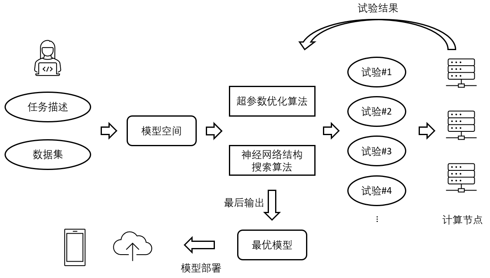
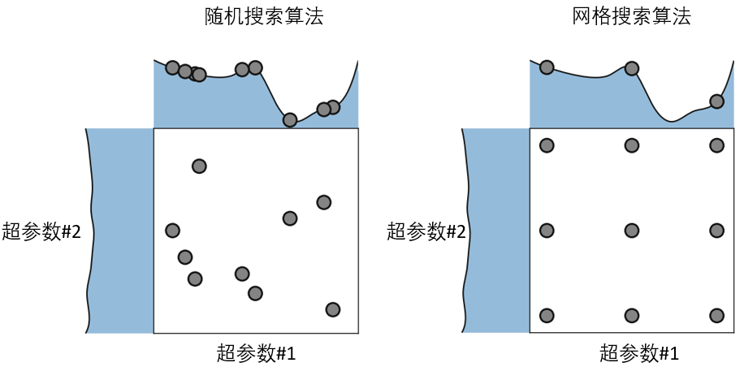
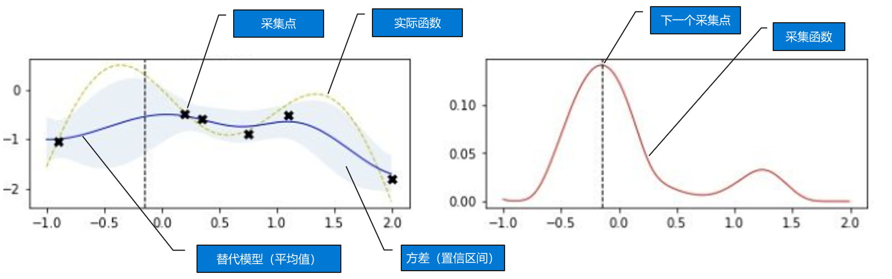
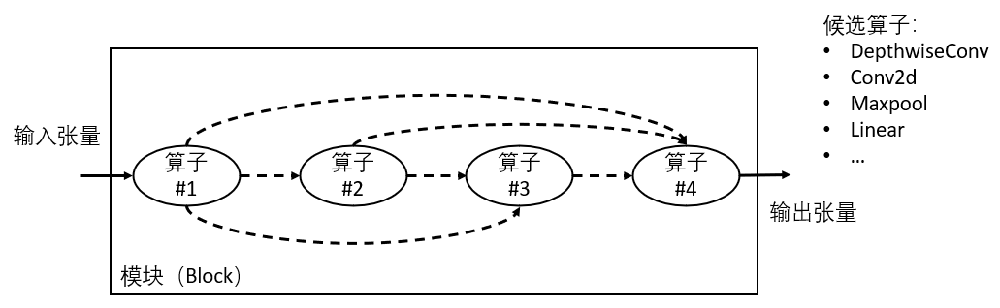
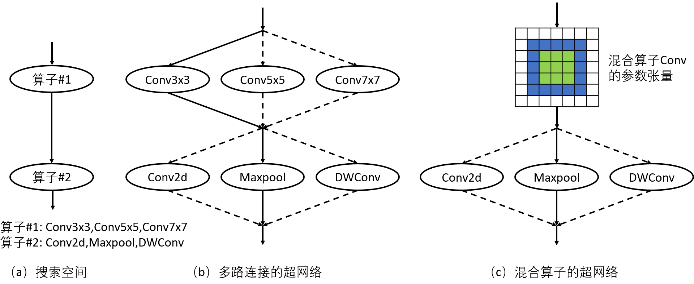
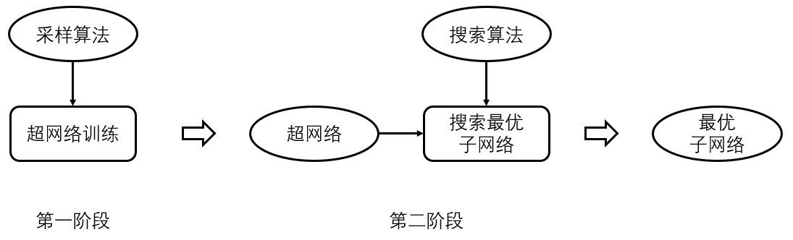

<!--Copyright © Microsoft Corporation. All rights reserved.
  适用于[License](https://github.com/microsoft/AI-System/blob/main/LICENSE)版权许可-->

# 9.1 自动机器学习

- [9.1 自动机器学习](#91-自动机器学习)
  - [9.1.1 超参数优化](#911-超参数优化)
  - [9.1.2 神经网络结构搜索](#912-神经网络结构搜索)
  - [小结与讨论](#小结与讨论)
  - [参考文献](#参考文献)

自动机器学习的核心是机器学习模型，对给定任务自动设计相应模型，这个过程含有两个主要的设计空间：模型的结构与模型（训练）的超参数。模型的结构包括不同类型的模型，如随机森林（Random Forest）、多层感知机（Multilayer Perceptron），也包括同一类模型的不同结构，如卷积神经网络（Convolutional Neural Network）中不同的网络结构。其中，在不同类型的模型中选择最合适的模型又被称为模型选择（Model Selection）。围绕着模型的自动设计与生成，自动机器学习的流程如图9-1-1所示。首先，用户提供想要使用机器学习模型的任务的描述以及数据集。对应该任务，存在一系列候选模型及其超参数的候选取值可能在该任务上取得较好的表现（Performance）。这些候选的模型结构及超参数取值构成了一个模型空间（Model Space）。自动机器学习会在这个模型空间中搜索，使用的搜索算法有两类：超参数优化算法和神经网络结构搜索算法。这些算法通常会从模型空间中采样出一系列具体的模型作为试验（Trial），在计算节点上运行并验证其表现。试验中得到的结果通常会返回给搜索算法，使算法生成更优潜力的试验，以此循环往复直到得到满足用户需求的模型。所得到的模型最终会被部署在云端或者终端设备上。

<center> </center>
<center>图9-1-1. 自动机器学习的基本流程</center>

## 9.1.1 超参数优化

***超参数优化概述***

在机器学习中，超参数是指机器学习模型各个方面可配置的参数。例如，在模型结构中丢弃率（Dropout Rate），卷积算子中的通道数（Channel Number），在模型训练中的学习率（Learning Rate），批尺寸（Batch Size）。超参数优化是指为这些可配置的参数在其可行域（Feasible Region）内寻找最优参数取值的过程。超参数的调优在机器学习领域也被戏称为“炼丹”，可见超参数在使机器学习模型获得好的表现中发挥着重要作用。传统的超参数调优是领域专家根据自己的既有经验设置超参数的取值然后验证该组取值的表现，根据对其表现的分析再结合自己的专家经验再设置一组新的超参数取值并验证其表现。重复这样的过程直到找到表现较好的超参数取值。这种手动超参数调优的过程通常是较为重复和繁琐的，因为很多时候即使是领域专家对于一个超参数具体取什么值时模型表现最好也无法确定，需要手动逐个试验。因此，相比于直接指定一组最优的超参数取值，由领域专家指定一个超参数取值的范围更加实际且合理。这里，范围即超参数被指定的可行域，也被称之为模型空间。在超参数的可行域内寻找最优超参数取值的过程，可以被搜索算法自动化起来，从而减少领域专家的单调而重复的调参工作，专注于模型的设计和创新。因此，在机器学习特别是深度神经网络蓬勃发展的时候，超参数优化算法也在快速迭代，以应对机器学习模型带来的新的优化机会和挑战。

如果更广义的理解超参数，超参数不仅存在于机器学习模型中，它还广泛存在于计算机系统的各个部件中，甚至整个工业生产的各个环节。例如，数据库系统中存在大量超参数（或称之为配置参数），像缓存(Cache)的大小，缓存替换算法的选择。再例如，食品工程中每种原料的添加量。在这些场景中，超参数优化同样可以提升配置和研发效率。本章主要围绕着机器学习和深度神经网络模型深入阐述超参数优化与神经网络结构搜索。

***超参数优化的形式化描述***

假设机器学习模型$M$的待调优超参数有$N$个，每个超参数$\theta_{i}$的可行域是$\Theta_{i}$。$\theta = (\theta_0, \theta_1, ..., \theta_{n-1}) \in \Theta$，其中$\Theta = \Theta_0 \times \Theta_1 \times ... \Theta_{n-1}$。模型$M$的一组超参数取值$\theta$在任务数据集$D$上的表现由评估函数$\digamma$得到，例如，$\digamma$返回模型$M$使用$\theta$在数据集$D$上的验证精度（Validation Accuracy）。$\digamma$通常需要针对模型和数据集来定义和实现。超参数优化的优化目标可以由下面的目标函数来形式化定义。

$$\underset{\theta \in \Theta}{argmax} \digamma (M, \theta, D)$$

超参数优化的过程如图9-1-1所示。超参数优化算法是整个搜索过程的核心，其优化目标则是上面的目标函数。整个过程形成一个产生超参数取值与收取反馈的闭环，直到找到满足要求的一组超参数取值或者预设的计算资源用尽。

***超参数优化算法***

超参数优化算法主要分为三类：暴力搜索（Brute-Force）算法，基于模型的（Model-Based）算法，和启发式（Heuristic）算法.

**暴力搜索算法**包括随机搜索算法（Random Search）和网格搜索算法（Grid Search）。随机搜索算法是指随机地在每个超参数的可行域中采样出一个取值，从而得到的一组超参数取值。有时用户会根据自己的先验知识指定超参数的分布（如均匀分布，高斯分布），超参数取值的随机采样会依据这个分布进行。网格搜索算法是指对于每个超参数，在其可行域范围内依次遍历其候选取值。通常网格搜索被用于处理离散型（Discrete）超参数，连续型超参数也可以通过转换到一些列离散取值来应用网格搜索算法。图9-1-2以两个超参数为例分别展示了随机搜索算法与网格搜索算法采样出的超参数取值在搜索空间中不同的分布。

<center> </center>
<center>图9-1-2. 随机搜索算法与网格搜索算法的示意图（TODO：重画）</center>

暴力搜索算法的特点是具有非常高的并行。在计算资源充足的情况下，它可以采样出成百上千组超参数的取值，验证它们的表现，从中挑选出最优者。这就要求自动机器学习系统能够*支持多试验并发运行*。

**基于模型的算法**一般被统称为SMBO（Sequential Model-Based Optimization）。这种算法会选择一种模型来拟合优化空间，并在基于拟合出的优化空间（拟合出的优化空间并不一定准确）做新的超参数取值的采样。具体来说，SMBO是在以下两个步骤上交替执行，以尽可能高效的采样出表现优秀的超参数取值：

  - 拟合模型：将已经运行结束并取得对应超参数表现的试验作为训练数据。使用该训练数据训练用于拟合优化空间的模型。
  - 基于拟合的模型采样：拟合后的模型在优化空间中的每组超参数取值，均有其对该组超参数取值在表现上评估。因此可以通过采样的方式选出该模型认为的最优超参数取值作为下次尝试对象。

以下是更详细的SMBO执行逻辑的伪代码。

```python
def SMBO(algo, eval_func, max_trial_num)
    # algo: 用于拟合超参数空间的模型
    # eval_func: 调参数的目标函数，通常是DNN模型
    # max_trial_num: 运行eval_func的次数
    trials = []
    for _ in range(max_trial_num):
        new_trial = sample_optimal(algo)
        perf = eval_func(new_trial)
        trials.append((new_trial, perf))
        algo = model_fitting(algo, trials)
    return trials
```

[SMAC算法](https://ml.informatik.uni-freiburg.de/wp-content/uploads/papers/11-LION5-SMAC.pdf)使用随机森林作为模型，可以为每组超参数取值计算出它的表现的均值和方差。每次生成新的试验的过程中，该算法会随机抽样大量的超参数取值（例如10,000个），并通过一个评估函数EI（Expected Improvement）从中选出最有希望的一个或者多个超参数取值。每一组超参数取值的EI的计算是基于由模型估计出来的该组超参数表现的均值和方差。核心思想是综合探索（Exploration）和利用（Exploitation），既快速收敛到区域最优点（Local Optimal）又可以发现足够的最优区域。另一大类基于模型的算法是基于高斯过程（Gaussian Process）。使用高斯过程做超参数搜索计算复杂度较高，是试验点数量的三次方复杂度，超参数数量的线性复杂度。因此较难应用在大规模超参数搜索的场景中。一些工作借鉴高斯过程的思想，对建模过程做了简化，如TPE。[TPE](https://proceedings.neurips.cc/paper/2011/file/86e8f7ab32cfd12577bc2619bc635690-Paper.pdf)的核心思量是将给定一组超参数取值计算其表现的概率分布p(loss|params)，转换为给定一个表现计算不同超参数取值取得这个表现的概率p(params|loss)。这里后者可以使用已得到的试验做近似估计。与SMAC类似，基于高斯过程的方法同样是使用EI做超参数的选取。

图9-1-3形象的展示了在超参数搜索的过程中，模型对搜索空间中不同区域的估计。随着试验数量的增加，模型对搜索空间的估计的置信度不断增加，表现为估计的方差变小。

<center> </center>
<center>图9-1-3. SMBO的优化过程</center>

**启发式算法**种类繁多，包括遗传算法（Evolutionary Algorithm），模拟退火算法（Simulated Annealing）。遗传算法是指维护一个种群，其中每个个体是一组超参数取值，根据这些个体的表现进行变异和淘汰，比如改变一个表现较好的个体的一个超参数取值来生成一个新的个体。具体变异和淘汰的方式有很多种，这里不展开介绍。在机器学习和深度学习领域，遗传算法通常会有较好的表现，特别是在搜索空间较大的情况下。模拟退火算法的整个搜索过程和遗传算法类似。它的初始状态可以是一组或者多组超参数取值，由一个产生函数基于当前超参数取值生成新的超参数取值。类似于遗传算法，这个产生函数可以是改变某个超参数的取值。然后使用一种接受标准（常用的是Metropolis标准）来决定是否接受这组新的超参数取值。

这些算法根据根据自身原理有自己最适合的超参数优化任务，有些擅长连续空间上的搜索（如高斯过程），有些适合离散空间上的遍历（如网格搜索），有些适合神经网络结构参数的搜索（如遗传算法），有些适合大搜索空间的快速遍历（如即将介绍的Hyperband）。这就要求自动机器学习系统*能够灵活插拔不同的超参数优化算法*，以满足不同的场景与需求。

***超参数优化过程在算法层面上的加速***

超参数优化在深度学习场景下通常极为耗时，因为每一个试验需要运行较长时间才能获得该组超参数的表现评估。一些算法会利用试验的运行特性，试验之间的关系，超参数搜索任务之间的关系，来加速超参数的搜索过程。

利用试验运行特性的超参数搜索。每个试验在运行过程中会输出中间结果（Intermediate Performance），如学习曲线。这些中间结果可以表现一个试验是否具有得到较好表现的潜质。如果中间结果表现就明显差于其他试验，则该试验可以被提前终止，释放计算资源给新的试验。这个过程被称之为早停（Early Stop）。典型的早停算法有Median Stop和Curve Fitting。Median Stop是指如果一个试验如果它的所有中间结果都低于其他试验对应中间结果的中位数，这个试验将被终止。Curve Fitting是使用曲线拟合的方式拟合学习曲线，用以预测该试验在未来epoch的表现，如果表现差于设定的阈值，则提前终止该试验。早停算法可以和搜索算法并行独立工作，也可以和搜索算法有机结合。结合的典型算法有[Hyperband](https://arxiv.org/pdf/1603.06560.pdf)和[BOHB](https://arxiv.org/pdf/1807.01774.pdf)。

利用试验之间关系的超参数搜索。一个超参数搜索任务产生的试验通常是针对同一个任务的，因此在有些情况下试验和试验之间可以共享模型的参数。[PBT](https://arxiv.org/pdf/1711.09846.pdf)属于这类超参数搜索算法。它的基本搜索框架基于遗传算法。其中新产生的个体（即一组新的超参数取值对应的模型）会从其父个体中继承模型权重，从而可以加速新个体的训练进程。

利用迁移学习（Transfer Learning）加速超参数搜索。相似的超参数搜索任务在超参数取值的选择上可以相互借鉴。

## 9.1.2 神经网络结构搜索

***神经网络结构搜索概述***

在深度学习领域，神经网络结构(Neural Architecture)是影响模型性能的一个关键因素。一方面，在深度学习发展的过程中，神经网络结构在不断迭代，带来更高的模型精度，如AlexNet、ResNet、VGG、InceptionV3、EfficientNet，再到后来十分流行的Transformer。另一方面，针对特定的场景，神经网络结构通常需要做有针对性的设计和调优，以达到预期的模型精度和模型推理延迟，例如，对模型的宽度、深度的调整，对算子（Operator）的选择。神经网络结构本质上是一个数据流图（Data Flow Graph），图中的节点是算子或者模块（Block），边是张量（Tensor）及其流向。由于图的变化的自由度较大，因此神经网络模型的研究人员尝试通过搜索的方式在一个神经网络结构的可行域空间中寻找最优的神经网络结构。这种技术被称之为神经网络结构搜索，简称为NAS（Neural Architecture Search）。

NAS技术主要面向两类场景，一类是用于探索和发现新的神经网络结构。这类研究工作从已有的各种神经网络结构中总结出结构特点并结合自己对神经网络结构的理解，构建出一个神经网络结构的搜索空间，以期该空间中存在更优的神经网络结构。[NASNet](https://arxiv.org/pdf/1707.07012.pdf)是这一类的一个经典工作。[AutoML-Zero](http://proceedings.mlr.press/v119/real20a/real20a.pdf)则更进一步期望使用基础的数学算子构建出整个神经网络模型。另一类NAS技术面向的场景是在给定的神经网络结构下寻找网络中各层大小的最优配比，以期将模型快速适配到对模型大小和延迟有不同需求的场景中。其中最典型的工作是[Once-for-All](https://arxiv.org/abs/1908.09791)。这种NAS技术非常适合将模型快速适配并部署到端侧设备上（Edge Device），从某种意义上说它和深度学习模型的剪枝技术在解决相似的问题。

近些年，虽然NAS技术得到了快速的发展，但是需要清楚NAS的适用范围。NAS并不能取代神经网络模型的专家或者领域专家，而更多的是作为提升模型设计效率的手段和加速深度学习模型落地的途径。网络结构搜索空间的设计仍然需要交由专家完成，在空间中寻找最优网络结构则交由神经网络结构搜索算法完成。这个过程和超参数优化类似。因此，可以预见未来的神经网络模型设计和调优的过程会由相辅相成的两个方面组成。一个方面是由专家设计或指定一个网络结构的宏观轮廓（Sketch），另一个阶段是由自动化模块细化这个宏观轮廓生成具体可执行的神经网络结构。这种模型设计和调优过程充分发挥了两者各自的优势，专家更了解逻辑层面上哪些操作（Operator），模块（Block or Cell）和连接（Connection）可能对当前任务更有优势，而自动化过程更适合精细地调优网络的各种连接、大小的配置。

神经网络搜索空间和神经网络搜索算法是NAS中的两个关键组件。下面会分别详细介绍。

***神经网络结构搜索空间***

神经网络搜索空间（以下简称NAS空间）是专家知识的凝练。首先，对于单个任务，它圈定了一个模型探索的范围，以此获得表现更好的模型；其次，对于一类任务，它是对在该类任务上表现较好的模型的一种归纳，从而在任何一个具体的任务上都可以在这个NAS空间中搜索到优秀的模型。

图9-1-4是一个简化的搜索空间的例子。其中计算流图的每个节点是一个算子（Operator），边是张量及其流向。在这个搜索空间中每个节点中的算子都可以从一个候选算子集合中选取。图中虚线表示一个节点的输入可以从其前驱节点的输出中任意选取，例如第三个节点可以接第二个节点的输出，也可以接第一个节点的输出，还可以同时接第一个和第二个节点的输出。可选的算子和可选的连边一起构成了完整的NAS空间。

<center> </center>
<center>图9-1-4. 一个神经网络结构搜索空间的例子</center>

一个NAS空间通常是面向某一个或者某一类任务设计的，而且相比于上面的例子更加复杂和完善，例如，[NASNet中的space](https://arxiv.org/pdf/1707.07012.pdf)，[MnasNet中的space](https://arxiv.org/pdf/1807.11626.pdf)，[DARTS中的space](https://arxiv.org/pdf/1806.09055.pdf)等等。一个搜索空间通常都包含$10^{10}$以上的不同的候选网络。目前，在NAS的研究中，不断有新的搜索空间被设计出来，使其包含新的网络结构（如Transformer结构），面向新的设备。各种各样的NAS空间使*简单而灵活得编写NAS空间*成为一个重要的需求，催生了机器学习工具新的演进方向，即，新的机器学习工具需要能够提供表达NAS空间的简单易用的编程接口。

***神经网络结构搜索算法***

神经网络结构搜索算法和超参数优化算法有很多相似之处，又存在很大的不同。相同之处在于，如果把神经网络结构空间使用超参数来描述的话，超参数优化算法都可以作为神经网络结构搜索算法使用。而不同之处在于神经网络结构搜索有其自己的特点，基于这些特点而设计的搜索算法和超参数搜索算法有很大的不同。

神经网络结构搜索算法可以分为三类：多试验搜索（Multi-trial Search）、单发搜索（Oneshot Search）和基于预测器的搜索（Predictor-based Search）。

**多试验搜索**中的算法最接近超参数优化算法。在多试验搜索中，搜索算法从搜索空间中采样出的每个网络结构都进行独立做表现评估，并将表现结果反馈给搜索算法。这里获得一个网络结构的表现评估通常需要在训练数据集上训练该网络结构。对于深度学习模型来说，这是一个非常耗时的过程，因此多试验搜索通常需要耗费大量的计算资源。在计算资源十分充足的情况下，这种搜索算法能够更稳定的找到搜索空间中表现优秀的网络结构。多试验搜索的经典算法有[NASNet](https://arxiv.org/pdf/1707.07012.pdf)中使用的强化学习算法，[AmoebaNet](https://arxiv.org/pdf/1802.01548.pdf)中使用的时效进化（Aging Evolution）。它们分别使用强化学习算法和进化算法不断采样有可能表现更优的网络结构。相比而言，进化算法通常需要的试验数量更少，收敛速度更快。如图9-1-1所示，多试验搜索的过程与超参数优化基本一致，只有采样内容上的区别，即，是超参数和神经网络结构。

**单发搜索**是目前神经网络结构搜索算法中比较流行的一类，主要原因是它在很大的搜索空间上需要的搜索时间远小于多试验搜索。它的核心思想是将搜索空间构建成一个超大的网络，称之为超网络（Supernet），将其作为一个模型训练。超网络将组合爆炸的网络结构数变成了一个线性复杂度的大模型，其中算子的权重会被所有包含该算子的网络结构所共享（即共同训练）。图9-1-5展示了一个超网络的例子，其中超网络的形式有两种：多路连接的超网络（Multi-path Supernet）和混合算子的超网络（Mixed-op Supernet）。

<center> </center>
<center>图9-1-5. 一个搜索空间对应的超网络 </center>

多路连接的超网络是将一个节点中的候选算子并排连接到超网络中，每个采样出的网络结构只激活每个节点中的一路，如图9-1-5(b)所示。采样出的算子会继承其在超网络中的权重，训练并将权重更新回超网络中。在超网络的训练中，通常每一个采样出的网络结构仅训练一个小批次（Mini-batch），因此在超网络的训练过程中，网络结构的采样非常频繁，采样策略也影响超网络的训练效果。由于权重的共享，每个子网的训练会更加高效。相比于每个子网独立从头独立训练，会大大降低计算资源的消耗。这类单发搜索的典型算法有[ENAS](http://proceedings.mlr.press/v80/pham18a/pham18a.pdf)、[DARTS](https://arxiv.org/pdf/1806.09055.pdf)，其中ENAS使用强化学习算法做网络结构的采样，而DARTS是在每一路上增加结构权重，通过可微分的方式训练结构权重并基于结构权重采样网络结构。

由于一个节点中的候选算子类型的差异，不同子网络共享权重时会产生互相拉扯的效果，影响超网络的训练效果。为了降低候选算子之间相互的影响，混合算子是一种新的权重共享方式，这里称之为混合算子共享。图9-1-5(c)的上半部分展示了以Conv2d为例的混合算子。其中，5x5的权重矩阵是7x7权重矩阵的子矩阵，3x3的权重矩阵又是5x5权重矩阵的子矩阵，因此混合算子的参数量和最大的算子的参数量相等。混合算子在超网络中的训练是每次采样其中一个候选算子所对应的参数矩阵，训练一个小批次并更新对应参数。这种共享粒度是在一个节点的候选算子之间做权重共享，而多路连接超网络中的共享是子网络在各个候选算子上的共享。混合算子中的权重共享，由于其算子类型相同只是算子大小存在差异，这种共享更加有效。混合算子共享的局限性也显而易见，即，一个节点的候选算子必须是同类型算子，对于图9-1-5(c)下半部分的节点则不能使用混合算子共享。

<center> </center>
<center>图9-1-6. 单发搜索的流程 </center>

超网络的训练只是单发搜索的第一阶段，单发搜索的整个过程如图9-1-6所示。第一个阶段会训练出一个超网络，训练的过程可以选择不同的子网络的采样算法，比如[三明治采样](https://arxiv.org/pdf/1903.05134.pdf)。训练得到的超网络用于第二阶段作为评估子网络表现的代理指标（Proxy Metric）。具体的，任何一个子网络在继承了超网络中的权重后可以直接在测试数据集上验证其表现，而不用从头训练该子网络，从而大大加速了搜索的过程。第二阶段是将超网络作为一种网络结构的代理评估器。搜索算法，如遗传算法，会在超网络上采样子网络，用子网络继承于超网络的权重做子网络表现的评估，并以此评估指导后续在超网络上的采样。最终搜索算法收敛到表现最优的若干个子网络。把这些子网络独立的从头训练获取它们真实的表现，找出其中表现最好的那个作为单发搜索最终的搜索结果。

**基于预测器的搜索**是训练一个网络结构的预测器，来预测每一个网络结构的表现。它比多试验搜索需要的计算资源少很多，但是通常多于单发搜索。因为预测器的训练仍然需要至少上百个从搜索空间采样出网络结构，将它们独立训练获得其表现。表现预测器基于这批网络结构的真实表现拟合得来。然后，训练好的预测器作为评估网络结构表现的代理指标。整个流程和单发搜索类似。区别在于单发搜索第一阶段产出的是训练好的超网络，而基于预测器的搜索第一阶段产出的是训练好的表现预测器。这类搜索算法的研究工作包括[BRP-NAS](https://arxiv.org/pdf/2007.08668.pdf)、[Neural Predictor](https://arxiv.org/pdf/2108.03001.pdf)。

从以上的介绍可以看出，一个搜索空间可以使用不同的搜索算法，一个搜索算法又可以被应用到不同的搜索空间上。这就要求自动机器学习系统和工具将*搜索空间的表达和搜索算法的实现解耦*。另外，无论是哪种搜索算法都对计算资源有较高的要求，这就需要系统和工具能够*分布式运行搜索过程*并且从系统层面上*优化训练和搜索的速度*。

## 小结与讨论

在机器学习模型被越来越多的部署在不同场景和应用中，自动化机器学习也掀起了一波新的热潮试图解决当前机器学习模型在设计和部署中难于扩展的问题。每一个具体的场景都需要模型开发人员深度介入做模型的设计和调优。目前，自动化机器学习已经对模型开发提供了很大的帮助，特别是自动超参数搜索。但是，距离更加自动化的设计模型还有不小的距离。其中自动化搜索算法上需要有进一步的创新。另外，一个易用、灵活、且强大的自动化工具是自动化机器学习发展和应用的基石。在下一节，我们将详细讨论自动化机器学习的系统与工具。

## 参考文献

<div id="xx-1"></div>

1. [Bergstra, James, Rémi Bardenet, Yoshua Bengio, and Balázs Kégl. "Algorithms for hyper-parameter optimization." Advances in neural information processing systems 24 (2011).](https://proceedings.neurips.cc/paper/2011/file/86e8f7ab32cfd12577bc2619bc635690-Paper.pdf)

2. [Hutter, Frank, Holger H. Hoos, and Kevin Leyton-Brown. "Sequential model-based optimization for general algorithm configuration." In International conference on learning and intelligent optimization, pp. 507-523. Springer, Berlin, Heidelberg, 2011.](https://ml.informatik.uni-freiburg.de/wp-content/uploads/papers/11-LION5-SMAC.pdf)

3. [Li, Lisha, Kevin Jamieson, Giulia DeSalvo, Afshin Rostamizadeh, and Ameet Talwalkar. "Hyperband: A novel bandit-based approach to hyperparameter optimization." The Journal of Machine Learning Research 18, no. 1 (2017): 6765-6816.](https://arxiv.org/pdf/1603.06560.pdf)

4. [Falkner, Stefan, Aaron Klein, and Frank Hutter. "BOHB: Robust and efficient hyperparameter optimization at scale." In International Conference on Machine Learning, pp. 1437-1446. PMLR, 2018.](https://arxiv.org/pdf/1807.01774.pdf)

5. [Jaderberg, Max, Valentin Dalibard, Simon Osindero, Wojciech M. Czarnecki, Jeff Donahue, Ali Razavi, Oriol Vinyals et al. "Population based training of neural networks." arXiv preprint arXiv:1711.09846 (2017).](https://arxiv.org/pdf/1711.09846.pdf)
- [Zoph, Barret, Vijay Vasudevan, Jonathon Shlens, and Quoc V. Le. "Learning transferable architectures for scalable image recognition." In Proceedings of the IEEE conference on computer vision and pattern recognition, pp. 8697-8710. 2018.](https://arxiv.org/pdf/1707.07012.pdf)

6. [Zoph, Barret, Vijay Vasudevan, Jonathon Shlens, and Quoc V. Le. "Learning transferable architectures for scalable image recognition." In Proceedings of the IEEE conference on computer vision and pattern recognition, pp. 8697-8710. 2018.](http://proceedings.mlr.press/v119/real20a/real20a.pdf)

7. [Cai, Han, Chuang Gan, Tianzhe Wang, Zhekai Zhang, and Song Han. "Once-for-all: Train one network and specialize it for efficient deployment." arXiv preprint arXiv:1908.09791 (2019).](https://arxiv.org/abs/1908.09791)

8. [Tan, Mingxing, Bo Chen, Ruoming Pang, Vijay Vasudevan, Mark Sandler, Andrew Howard, and Quoc V. Le. "Mnasnet: Platform-aware neural architecture search for mobile." In Proceedings of the IEEE/CVF Conference on Computer Vision and Pattern Recognition, pp. 2820-2828. 2019.](https://arxiv.org/pdf/1807.11626.pdf)

9. [Liu, Hanxiao, Karen Simonyan, and Yiming Yang. "Darts: Differentiable architecture search." arXiv preprint arXiv:1806.09055 (2018).](https://arxiv.org/pdf/1806.09055.pdf)

10. [Real, Esteban, Alok Aggarwal, Yanping Huang, and Quoc V. Le. "Regularized evolution for image classifier architecture search." In Proceedings of the aaai conference on artificial intelligence, vol. 33, no. 01, pp. 4780-4789. 2019.](https://arxiv.org/pdf/1802.01548.pdf)

11. [Pham, Hieu, Melody Guan, Barret Zoph, Quoc Le, and Jeff Dean. "Efficient neural architecture search via parameters sharing." In International conference on machine learning, pp. 4095-4104. PMLR, 2018.](http://proceedings.mlr.press/v80/pham18a/pham18a.pdf)

12. [Yu, Jiahui, and Thomas S. Huang. "Universally slimmable networks and improved training techniques." In Proceedings of the IEEE/CVF international conference on computer vision, pp. 1803-1811. 2019.](https://arxiv.org/pdf/1903.05134.pdf)

13. [Dudziak, Lukasz, Thomas Chau, Mohamed Abdelfattah, Royson Lee, Hyeji Kim, and Nicholas Lane. "Brp-nas: Prediction-based nas using gcns." Advances in Neural Information Processing Systems 33 (2020): 10480-10490.](https://arxiv.org/pdf/2007.08668.pdf)

14. [Wen, Wei, Hanxiao Liu, Yiran Chen, Hai Li, Gabriel Bender, and Pieter-Jan Kindermans. "Neural predictor for neural architecture search." In European Conference on Computer Vision, pp. 660-676. Springer, Cham, 2020.](https://arxiv.org/pdf/2108.03001.pdf)
