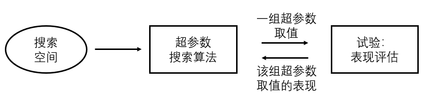

<!--Copyright © Microsoft Corporation. All rights reserved.
  适用于[License](https://github.com/microsoft/AI-System/blob/main/LICENSE)版权许可-->

# 9.1 自动化机器学习

- [9.1 自动化机器学习](#91-自动化机器学习)
  - [9.1.1 超参数搜索](#911-超参数搜索)
  - [9.1.2 神经网络结构搜索](#912-神经网络结构搜索)
  - [9.1.3 自动特征工程](#913-自动特征工程)
  - [小结与讨论](#小结与讨论)
  - [参考文献](#参考文献)

## 9.1.1 超参数搜索

（超参数搜索的应用）

超参数搜索是指在每个超参数可行域内寻找最优超参数取值的过程。超参数广泛存在于机器学习模型中，例如，学习率(learning rate)，批大小(batch size)。设计机器学习或者深度学习模型被调侃的称之为“炼丹”，也说明超参数在模型中的重要性，以及超参数搜索在整个模型设计过程中所占较高的比重。传统的方式是领域专家根据自己的经验设置超参数的取值然后验证该组取值的表现(performance)，根据对效果的分析再结合自己的专家经验来设置新的超参数取值，然后验证其表现。重复这样的过程直到找到满足需求的超参数取值。这种手动超参数调优的过程通常是较为枯燥的，而且很多时候即使是领域专家，对于一个超参数具体取什么值效果最好也是拿捏不定，更多的是根据自己的专家经验确定超参数取值的大致范围。因此，自动超参数搜索应运而生，帮助模型开发者减少模型设计过程中繁杂的调优任务，使模型开发者更专注于模型结构和组件的设计。

另外，超参数不仅仅存在于机器学习模型中，它广泛存在于计算机系统的各个部件中，甚至整个工业生产的各个环节。例如，数据库系统中也存在大量超参数（或称之为配置参数），像缓存(cache)的大小，缓存替换算法的选择。例如，食品工程中一个食品的原料添加量。在这些场景中，自动超参数搜索都可以扮演重要的角色，使整个过程更加自动化。

（超参数搜索的形式化搜索目标和架构）

$$\underset{\theta_{1...n}}{argmax} f_{perf}(\theta_1,\theta_2, ...,\theta_n)$$

超参数搜索的形式化搜索目标可以上面的公式统一表达。其中，$\theta_i$指代的不同的超参数。对于不同的场景和任务，$f_{perf}$这一优化的目标函数的定义也不相同。例如，对于机器学习模型，优化的目标函数通常是模型的验证精度(validation accuracy)。

整个超参数搜索的优化过程如下图所示。自动超参数搜索算法是搜索过程的核心，超参数的取值由该算法产生一组或者多组超参数取值。每一组超参数作为一个试验(Trial)，通过合适的方式（如模型训练）获得该组超参数的表现评估。表现评估会返回给超参数搜索算法。超参数搜索算法通常会依据收到的表现评估来决定下一组或多组希望尝试的超参数取值。循环这个过程直到获得满足需求的超参数取值。

 

图9-1-1. 超参数搜索流程

（超参数搜索算法）

超参数搜索算法有很多种，传统的通常可以分为三类：暴力搜索(brute-force)算法，启发式(heuristic)算法，和基于模型的(model-based)算法.

暴力搜索算法包括随机搜索算法(random search)和网格搜索算法(grid search)。随机搜索算法是指随机地在每个超参数的可行域中采样出一个取值，从而得到的一组超参数取值。有时用户会根据自己的先验知识指定超参数的分布（如均匀分布，高斯分布），超参数取值的随机采样会依据这个分布进行。网格搜索算法是指对于每个超参数，在其可行域范围内依次遍历尝试其取值。通常网格搜索被用于处理具有离散空间的超参数，对网格搜索做合理的调整也可以使其能够处理连续空间的超参数。

常用的启发式算法包括遗传算法(evolutionary algorithm)，模拟退火算法(simulated annealing)。遗传算法是指维护一个种群，其中每个个体是一组超参数取值，根据这些个体的表现进行变异和淘汰，比如改变一个表现较好的个体的一个超参数取值来生成一个新的个体。具体变异和淘汰的方式有很多种，这里不展开介绍。在机器学习和深度学习领域，遗传算法通常会有较好的表现，特别是在搜索空间较大的情况下。模拟退火算法的整个搜索过程和遗传算法类似。它的初始状态可以是一组或者多组超参数取值，由一个产生函数基于当前超参数取值生成新的超参数取值。类似于遗传算法，这个产生函数可以是改变某个超参数的取值。然后使用一种接受标准（常用的是Metropolis标准）来决定是否接受这组新的超参数取值。

基于模型的算法有很多，总结来说通常是在贝叶斯框架下。。。

（超参数搜索过程在算法层面上的加速）

超参数搜索在深度学习场景下通常是一件极为耗时的事情，因为每一个试验需要运行较长时间才能获得该组超参数的表现评估。一些算法会利用试验的运行特性，试验之间的关系，模型之间的关系，来加速超参数的搜索过程。一类是基于中间表现(intermediate performance)的超参数搜索，一类是基于迁移学习(transferrable learning)的超参数搜索。。。

## 9.1.2 神经网络结构搜索

（nas简介）

在深度学习领域，神经网络结构(neural architecture)是影响模型性能的关键因素。一方面在深度学习发展的过程中，神经网络结构在不断迭代，不断带来更高的模型精度。另一方面，针对特定的场景，神经网络结构需要做有针对性的设计和适配，（比如。。。），以达到预期的模型精度和模型的推理延迟。这个过程是对神经网络结构的设计和调优。一个高效的网络结构设计和调优过程可以分为两个相辅相成的阶段。一个阶段是由专家设计或指定一个网络结构的宏观轮廓(sketch)，另一个阶段是由自动化模块细化这个宏观轮廓生成具体可执行的神经网络结构。这种模型设计和调优过程充分发挥了两者各自的优势，专家更了解逻辑层面上哪些操作(operator)，模块(block or cell)和连接(connection)可能对当前task更有优势，而自动化过程更适合调优细节的操作放置，模块大小，连接选择等等。前者也可以称之为专家定义的搜索空间，而后者是自动的搜索算法。

（搜索空间）

神经网络结构搜索空间是专家知识的凝练，其中每一个搜索空间包含了对于某一个或者某一类任务可能表现优异的一系列网络结构。通常一个神经网络结构搜索的搜索空间包含$10^{10}$以上的不同网络结构。

目前，研究领域已经提出了很多网络结构搜索空间，包括针对计算机视觉的和自然语言处理方向的深度学习模型。一个网络结构搜索空间通常是由可选的算子(如Conv2d，DepthwiseConv)，可选的连接（如算子之间的连接方式），和可选的网络结构超参数(如算子的数量)。图9-1-2是一个神经网络搜索空间的一个例子。图中每一个节点是。。。

 

图9-1-2. 一个神经网络结构搜索空间的例子

（搜索算法）

神经网络结构搜索的搜索算法可以分为两大类：多试验搜索(multi-trial search)和单发搜索(oneshot search)。多试验搜索是指在搜索空间中采样的每个网络结构独立做表现评估。这里表现评估也分为两种方式：一种是获取网络结构的真实表现(ground-truth performance)，另一种是通过代理获取网络结构的表现，如使用表现预测器(performance predictor)。使用前一种评估方式的多试验搜索有很多经典算法，如NASNet，regularized evolution。这类网络结构搜索算法通常会耗费大量的计算资源，同时也更容易找到搜索空间中表现优秀的网络结构。使用后一种评估方式的多试验搜索算法在研究上更多的侧重于如何获取更加准确的表现预测器。表现预测器通常基于一批网络结构的真实表现拟合得来。如--。这类方法的优势是使用的计算资源相对会少很多，但是其表现预测器的精度也依赖于已知真实表现的网络结构的数量，数量越多精度也会越高。多试验搜索的过程和超参数搜索图9-1-1非常类似，只是把超参数换成了神经网络结构。

单发搜索是目前神经网络结构搜索算法中比较流行的一类。它的核心思想是将搜索空间构建成一个超大的网络，称之为超网络(super-net)，将其作为一个模型训练。图9-1-3展示了一个超网络的例子。一个节点的所有候选算子都会被连接到超网络中。每一个小批次(mini-batch)训练超网络中采样出来的一个子网络，该子网络继承超网络中的算子权重，做一个小批次的训练，将获得的权重的梯度更新到对应的超网络中。可以看出采样出来的子网络之间是在共享互相之间共有算子的权重，因此每个子网的训练会更加高效。相比于每个子网独立从头独立训练，会大大降低计算资源的消耗。

 

图9-1-3. 一个搜索空间对应的超网络

目前算子的权重共享有两种方式，一种是每个候选算子独立共享，另一种是一个节点的候选算子权重混合共享。图9-1-4展示了两种权重方式。目前混合共享相对更加有效。权重共享下的训练方式也有很多种，如三明治方式，蒸馏方式等等，在此不做详述。

 

图9-1-4. 算子权重共享的两种方式

超网络的训练单发搜索的第一阶段，还需要通过第二阶段基于超网络的网络结构搜索才能找到好的网络结构。第二阶段是将超网络作为一种网络结构的代理评估器。搜索算法，如遗传算法，会在超网络上采样子网络，用子网络继承于超网络的权重做子网络表现的评估，并以此评估指导后续在超网络上的采样。最终搜索算法收敛到表现最优的若干个子网络。把这些子网络独立的从头训练获取它们真实的表现，找出其中表现最好的那个作为单发搜索最终的搜索结果。

## 9.1.3 自动特征工程

...

## 小结与讨论

（自动化机器学习的局限）

在机器学习模型被越来越多的部署在不同场景和应用中，自动化机器学习也掀起了一波新的热潮试图解决当前机器学习模型在设计和部署中难于扩展的问题。每一个具体的场景都需要模型开发人员深度介入做模型的设计和调优。目前，自动化机器学习已经对模型开发提供了很大的帮助，特别是自动超参数搜索。但是，距离更加自动化的设计模型还有不小的距离。其中自动化搜索算法上需要有进一步的创新。另外，一个易用、灵活、且强大的自动化工具是自动化机器学习发展和应用的基石。在下一节，我们将详细讨论自动化机器学习的系统与工具。

## 参考文献

...